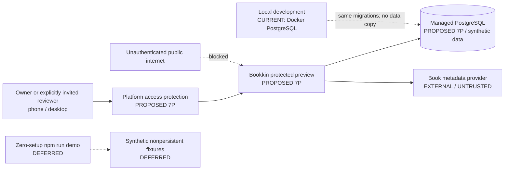
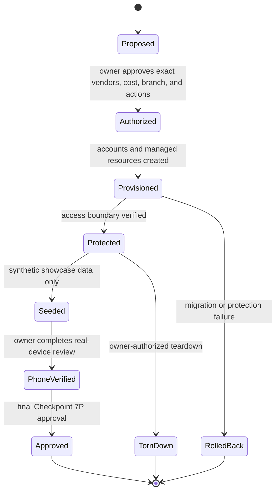

# Bookkin Software Development Document and Agentic Build Plan

Status: canonical planning document; Checkpoint 6 delivered; Checkpoint 7A delivered and awaiting final owner review; Checkpoint 7B BLOCKED pending a section 2.3 amendment

Last revised: 2026-08-18

The human product owner approved this SDD on 2026-08-14 and approved and delivered Checkpoints 4R, 5A, 5B, and 6. On 2026-08-15, the owner explicitly authorized Checkpoint 7 to begin; under the approved split sequence, this authorizes Checkpoint 7A only. On 2026-08-16, the owner approved adding a separately gated protected-preview foundation after 7A so real-phone review can begin earlier, approved the Checkpoint 7A phase-one proposal and interactive design gate (see `docs/architecture/checkpoint-7a-phase-one-proposal.md`), and approved the token-frugality, design-direction-lock, copy-discipline, recommendation-intelligence-review, and cost-structure additions recorded throughout this document. Phase-one approval authorizes bounded Checkpoint 7A implementation only. It does not authorize deployment, accounts, hosted resources, Checkpoint 7P, Checkpoint 7B, later-checkpoint implementation, or public actions. Final Checkpoint 7A approval for commit/push still requires completed implementation, independent review, and a separate explicit approval.

## 1. Purpose

This document is the canonical software development document (SDD) and execution plan for Bookkin. It is written for human owners, lead coding agents, specialist agents, and independent reviewers.

The plan has two separate state machines:

- Technical state: proposed, in progress, implemented, verified, or blocked.
- Authorization state: awaiting human review, changes requested, or explicitly approved.

Technical completion never implies authorization. A reviewer PASS, passing tests, CI success, agent consensus, or lead-agent confidence cannot approve a checkpoint.

## 2. Product definition

Bookkin is a private family preference engine that helps caregivers choose better books for public-library trips.

It is not primarily:

- A reading tracker.
- A personal catalog.
- A social reading product.
- A library-account client.
- An engagement, reward, or streak system.
- An AI-generated book universe.

The V0.1 promise is:

> Give Bookkin a small amount of truthful family context, receive a verified library bag in under approximately ten minutes, check candidates in the official library catalog, and record what happened so later bags improve.

The initial target is a caregiver reading picture books or early readers with one or more children approximately ages 2-8 and visiting a public library at least monthly. Every history, explicit preference, request, candidate pool, and recommendation bag is scoped to one selected child profile. Cross-child or combined family bags are deferred.

### 2.1 Primary loop

1. Collect the minimum truthful family context.
2. Source and normalize verified candidate works.
3. Rank and compose candidates deterministically.
4. Present a small evidence-based recommendation bag.
5. Hand the caregiver to the official library catalog.
6. Learn from explicit saves, recommendation-level `Not for us` actions, scans, borrowing confirmations, reading events including `Decided not to read`, separate reactions, and rereads.

First value must not require shelf construction, five logged books, a library branch, camera permission, a reaction, or a prior reading event.

### 2.2 Cold-start contract

The minimum context for a first recommendation request is:

> A completed child reading profile with one coarse age range and at least one current reading-relationship choice, plus at least one useful recommendation signal from valid reading/reaction history, one declared current topic interest, one declared controlled kind-of-book preference, one durable remembered work, or one verified request-only reference work.

A nickname is optional. Exact birthdate, child photo, school, address, voice, and location history are not requested.

The verified reference may be either an explicitly retained durable `PreferenceObservation` (for example, "A book that worked for us") or a request-scoped `RecommendationRequestReference` (for example, "More like this"). The user chooses the meaning; neither path creates implicit shelf, history, event, reaction, status, or borrowing facts.

### 2.3 Product invariants

- Metadata, candidates, ranking inputs, history, and library capabilities are verified or explicitly user-declared.
- Missing metadata remains missing; the system never fills gaps by invention.
- Child evidence, caregiver evidence, and family-level references remain distinguishable.
- A family-level reference is never translated into "both liked it."
- The subject of an observation and the person who reported it are separate fields.
- Reactions are optional and separate from reading events.
- Reading events and reactions are never preselected.
- Reread counts derive only from currently valid reading events.
- AI cannot create candidates, metadata, rankings, facts, availability, history, or preference evidence.
- The official library catalog is the only V0.1 source for availability.
- Bookkin does not request or store library credentials, card numbers, or PINs.
- Private household data is not publicly exposed or intentionally cached for offline reload.
- Human approval is required at every checkpoint.

## 3. Experience direction: bounded Bright Snap

Bright Snap is the visual language for Bookkin. It combines child-friendly energy with parent-facing polish and restraint.

Required characteristics:

- Yellow, ink, white, and restrained supporting accents.
- Focus, lens, crop, flash, or capture motifs used as identity cues.
- Energetic capture, confirmation, and recommendation-reveal moments.
- Calmer shelf, history, profile, quick-log, modal, and bedtime surfaces.
- Sentence-case consumer copy except for short intentional display labels.
- Clear hierarchy, generous whitespace, refined typography, and polished transitions.
- Large imagery where it supports recognition, with density controls for large collections.
- Fast search and filtering wherever collection size can grow.
- One persistent, elegant thumb-reachable action control for Add book and Log a read on mobile.
- Add and Log workflows open in focused modal or sheet experiences and do not require page scrolling to start.
- A compact child-profile selector keeps the active child explicit wherever history, preferences, requests, or recommendations are shown. Switching profiles never merges evidence.
- Initial age range, overlapping reading relationships, current interests, and kinds-of-books choices are collected during child-profile setup and edited later under that child’s Reading profile settings. They are not a permanent top-level `Learning` destination.
- The Reading profile describes only explicit setup and current-context signals. Reading history, reactions, rereads, stopped reads, and later recommendation feedback remain the primary accumulated evidence and are summarized separately without implying an inferred child personality.
- A request-only reference is presented only inside the recommendation-request flow with the wording `More like this book`. It never appears as a standalone profile-setting action and never creates durable preference, shelf, or history evidence.
- Contextual Back returns to the immediate entry surface. Book history opened from Shelf returns to the same Shelf state; book history opened from household History returns to that History list. Restore scroll and focus to the triggering book. Browser Back follows the same stack and restoration rule. The persistent History navigation is the direct route to household History, so do not add a redundant "All history" action.
- No unexplained numerical markers inside the product UI.

Accessibility and sensory constraints:

- WCAG 2.2 AA contrast target.
- Visible keyboard focus and logical focus return.
- Semantic names, descriptions, and live status announcements.
- 44 x 44 CSS pixels minimum touch target; 48 x 48 preferred for primary and reaction controls.
- No color-only meaning.
- Reduced-motion support.
- No automatic pulsing, orbiting, confetti, audio, vibration, or flashing.
- Lower visual energy and luminance on repetitive and bedtime-oriented surfaces.
- No horizontal scroll at a 320 CSS-pixel viewport and no clipped content or focus at 400 percent zoom.

### 3.1 Required design review for user-facing checkpoints

Before implementation, the lead presents an interactive, marked-up HTML prototype using realistic non-sensitive fixtures. It includes representative phone, tablet, and desktop compositions, state controls, and selectable comments in a separate review panel.

The product frame must use polished end-user language throughout. Prototype labels, sample-data notices, implementation explanations, reviewer guidance, and placeholder narration belong only in the separate design-comments area and must never appear as product copy.

This rule is absolute and is checked before the owner sees any prototype. Every visible string inside the product frame is proposed final product copy written for a caregiver. Specifically forbidden inside the product frame:

- Lorem ipsum, `TBD`, `TODO`, dummy strings, and unwritten or approximate copy.
- Schema, field, contract, or checkpoint vocabulary used as a user-visible heading or label, such as `About and reading relationship`, `evidence`, `phase`, `observation`, `snapshot`, or `provenance`.
- Design-rationale, product-philosophy, or reviewer-directed sentences used as helper text, such as a section subtitle explaining that its contents are "explicit profile details," "not profile settings," or "only what you explicitly saved."
- Copy that defends or narrates the system's own design decisions rather than helping the caregiver do the task.

The test is whether the string helps a caregiver complete or understand their own task. Reassurance that answers a real parent worry is good product copy and is allowed; telling the caregiver how Bookkin models its data is not. For example, "Choose all that fit. These can overlap and aren't a reading assessment" reassures a parent who fears their child is being judged, and belongs in the product. "Explicit profile details, not an assessment" as a section subtitle describes the data model to a reviewer, and belongs in the design-comments panel or nowhere.

The owner must never have to ask whether a string is real copy or a placeholder; if that question arises, the review has failed and the lead corrects the copy before re-presenting. Every design comment that explains a design decision belongs in the separate review panel, and the corresponding product string is rewritten in plain caregiver language. Copy review is an explicit acceptance item for every user-facing checkpoint, not an implementation detail deferred to build time.

Until the owner selects a final system, every user-facing design review develops these two directions in parallel against the same content, states, and interactions:

- **Original Bright Snap:** the high-contrast graphic camera language established in `bookkin-concept-bright-snap.html` - yellow, ink, white, cyan, rose, geometric display type, crisp borders, and restrained offset shadows.
- **Refined Brighter:** the default review direction - the same bright Snap identity with editorial warmth, luminous cool neutrals, softer geometry, and parent-facing restraint. Do not regress to beige, brown, or a lower-energy default.

A designer may propose a third direction only when it tests a genuinely distinct product hypothesis; it must not blur or replace the two required comparison tracks.

**Any design pivot or new user-facing surface is presented as at least three distinct options.** The owner chooses; the lead does not present a single design for ratification, and does not present only two. The options must differ in approach — information architecture, emphasis, or interaction model — not in decoration; three variations of one layout are one option presented three times and do not satisfy this. The lead states a recommendation among them, and every option remains genuinely choosable. This is additional to the two-direction visual-language comparison above: once a visual direction is locked, the three-or-more options concern layout, hierarchy, and approach within that language. The Checkpoint 5A exploration worked this way across nine concepts and produced the Personal Librarian thesis that later proved correct, which is the precedent this rule preserves.

The owner selects a final direction no later than the Checkpoint 7P protected-preview review, using the preview-only styling toggle (see Checkpoint 7P) so real feedback replaces the lead building and reviewing both directions in every subsequent prototype. Checkpoint 8 and later user-facing design reviews present the selected direction only.

Owner corrections made during design review are durable product decisions, not conversational memory. In the same review cycle, the lead records each accepted correction in this SDD or the owning document under `docs/design/`, keeps the interactive review aligned, and reports the changed decision record. Future agents must read those files instead of relying on chat history.

The prototype is a decision artifact, not implementation permission. After implementation, the working screen is reviewed at phone and desktop widths, and the interactive review is updated to reflect the implementation. Keyboard flow, focus, contrast, error recovery, loading, empty, limited, and offline states are checked before the checkpoint report.

### 3.2 Required architecture and data-design review

Every owner-facing decision that materially changes system architecture, data ownership, persistence, provider boundaries, deployment topology, or schema must include diagrams in both the owning proposal/ADR and the checkpoint presentation:

- A current-versus-proposed architecture or data-flow diagram.
- An entity-relationship, lifecycle, or sequence diagram when records or state transitions are involved.
- Labels for current, proposed, and deferred elements, plus household ownership, private-data, trust, and external-system boundaries.
- A short legend and decision callouts so the owner can recommend changes without reconstructing relationships from prose.

Keep diagrams bounded and readable rather than exhaustive. Diagrams are decision artifacts and do not grant implementation authority.

## 4. V0.1 scope

V0.1 ends only after Checkpoint 11 is explicitly approved.

Required:

- One protected household with one or more caregiver-managed child profiles.
- Protected responsive mobile web over HTTPS.
- PostgreSQL-backed hosted persistence after Checkpoint 5B approval.
- Optional nickname, one coarse age range, and one or more nonexclusive current reading-relationship choices.
- Editable current interests with retained historical phases.
- Editable child-specific kinds-of-books preferences from a controlled V0.1 vocabulary, separate from topic interests and observed reading outcomes.
- Durable, source-attributed preference observations created only after explicit input.
- Request-scoped recommendation references without shelf or history side effects.
- Verified ISBN, title, author, camera, and batch discovery.
- Shelf records created only after explicit user action.
- Truthful owned, borrowed, or wishlist status where applicable.
- Append-only reading events and amendment or retraction corrections.
- Optional separate child and caregiver reactions.
- Derived reread counts from valid events.
- Verified candidate sourcing and provenance.
- Deterministic scoring, composition, and explanations.
- Normal bags of 3-5 works, limited results of 1-2 works, and zero-result recovery.
- Official Johnson County Library catalog search.
- Bounded Bright Snap visual language.
- Honest loading, empty, limited-evidence, limited-pool, no-result, provider-error, duplicate, permission, external-handoff, and offline states.
- Alpha-safe backup, restore, rollback, monitoring, deletion, export, and measurement.
- Explicit human approval after every checkpoint.

Deferred:

- Required LLM or AI behavior.
- PWA installability, service worker, and offline product promise.
- Private-response caching, queued writes, or synchronization.
- Preferred library branch.
- Real-time availability, holds, library login, current loans, or borrowing-history import.
- Combined family recommendation bags, identified caregivers, or household invitations before controlled beta.
- Public child profiles or child accounts.
- Social graphs, feeds, sharing, popularity, streaks, or disappearing records.
- Public registration. Neither Checkpoint 12A nor 12B authorizes it; it requires a separately specified future checkpoint.
- Public acquisition work before explicit owner authorization to begin Checkpoint 12B, and publication before final Checkpoint 12B approval.
- Billing, paywalls, advertisements, sponsorships, affiliates, or sponsored ranking.
- Child-data monetization.
- Native applications, microservices, and large-scale recommendation infrastructure.

## 5. Domain contracts frozen at Checkpoint 5B

These semantics and their phase-one tables, constraints, indexes, lifecycle, and migration boundaries were approved at the Checkpoint 5B schema gate on 2026-08-15. Later-checkpoint deferrals remain in force.

### 5.1 PreferenceObservation

When a user explicitly selects "A book that has worked for us," Bookkin may create a durable, source-attributed `PreferenceObservation` recorded at declaration time.

It must:

- Link to a verified `BookWork`.
- Record declaration time and provenance.
- Keep reading time unknown unless a separate truthful reading event exists.
- Store observation subject separately from reporter.
- Allow `child`, `caregiver`, or `family_reference` as explicit subjects.
- Default a child-subject observation to caregiver-reported unless an approved interaction supports direct child selection.
- Treat `family_reference` as a distinct, weaker signal.

It must not implicitly create:

- A `ReadingEvent`.
- A `Reaction`.
- A `FamilyBook`.
- A shelf status.
- A finish or reread.
- A borrowing fact.

An incorrect observation is corrected through source-preserving retract or replace semantics. A retracted observation is excluded immediately from taste evidence, scoring, explanations, and attribution. Privacy deletion remains a separate operation.

### 5.2 RecommendationRequestReference

When a verified work is used only for "More like this," it is stored as a `RecommendationRequestReference` on the request or result.

It does not become durable taste evidence and does not create shelf, history, reaction, or preference records. Retaining it later as a preference is a separate confirmed action.

### 5.3 Reading corrections

Reading events remain append-only. "Correct entry" creates an amendment chain:

- `retract`: the original remains auditable but is excluded from current timelines, reread counts, taste inputs, and recommendation attribution.
- `replace`: retracts the original and links a new valid event.
- Corrected reactions attach to the replacement event.
- Derived views use the latest valid chain.
- Ordinary correction does not silently mutate or delete the original record.
- Household deletion remains a separate privacy operation that removes household-owned records.

Consumer wording distinguishes:

- "Stopped reading": reading began but did not finish.
- "Decided not to read": the household made an explicit reading decision, recorded as the internal `rejected` `ReadingEvent`.
- "Not for us": the family does not currently want the book recommended, recorded as a recommendation-level `RecommendationAction`.

Optional reasons are controlled and skippable.

### 5.4 Authoritative event taxonomy

- `ReadingEvent` records a reading-session outcome or explicit reading decision: `finished`, `reread`, `stopped`, or internal `rejected` shown to consumers as "Decided not to read."
- `RecommendationAction` records an explicit recommendation interaction: save, `Not for us`, catalog open, replacement request, or an attribution link.
- Borrowed and returned are explicit shelf-relationship transitions; they are not reading events.
- Child-selected and caregiver-selected are explicit selection provenance on the relevant action or encounter; they are not reading events.
- A recommendation may be attributed to a later finish or reread by linking to a valid `ReadingEvent`. The attribution does not replace or duplicate that event.
- Only valid `ReadingEvent` chains contribute to reading history and reread counts.

Reactions and interest phases also use source-preserving correction. A corrected reaction or interest is superseded or retracted, excluded immediately from current taste and scoring, and retained only as auditable history until household privacy deletion.

## 6. Recommendation contract

### 6.1 Result types

- `normal`: 3-5 verified eligible works; target 5.
- `limited_verified_pool`: 1-2 verified eligible works.
- `no_eligible_candidates`: 0 works.

The system never pads a result with an unverified, duplicate, excluded, or weakly eligible work. Limited evidence and limited candidate coverage are separate states.

Each returned work retains:

- Provider provenance.
- Eligibility evidence.
- Available and missing metadata.
- Deterministic score and source signals.
- Scoring and composition versions.
- Composition role.
- Deterministic explanation.
- Deduplication and exclusion behavior.

### 6.2 Deterministic baseline

V0.1 ranking, composition, and explanations are deterministic and inspectable. Fixed inputs and versions produce repeatable ranks and explanations. Missing attributes behave neutrally. Provider failure cannot introduce fabricated fallback books.

A local LLM is deferred. It may later be evaluated only behind `AIProvider` after a separate human privacy, cost, latency, and operational gate. It may reword approved explanation clauses using verified structured facts. It cannot change candidate inclusion, score, rank, composition, or facts. Deterministic wording remains available and LLM failure cannot block a bag.

### 6.3 Why the V0.1 baseline is deterministic, and what would change that

This section records the reasoning behind the deterministic decision so future agents and the owner can revisit it against evidence instead of re-arguing it from intuition. The owner has registered standing skepticism that a deterministic baseline can feel smart enough; Checkpoint 11A exists to settle that question with observed evidence rather than assertion.

`Deterministic` here means no model computes the score; a human sets and reviews the weights, and the same input always produces the same output. It does not mean simple, static, or unpersonalized. Bookkin's advantage is that the signals feeding that scorer are unusually good and unusually honest:

- Declared structure: coarse age range, overlapping reading relationships, current topic interests, controlled kinds-of-books preferences.
- Observed outcome evidence that accumulates with use: finishes, rereads, stopped reads, `Decided not to read`, separate child and caregiver reactions, and recommendation-level `Not for us`.
- Verified work metadata with explicit provenance and explicit missingness.

Personalization and improvement over time come from those feedback loops, not from the scoring mechanism. A reread is a strong positive signal and a `Not for us` is a strong negative signal regardless of whether a neural network or a weighted sum consumes it.

**Recommendation approaches actually fall into three tiers, not two, and it matters which one a system like Netflix uses.** The owner asked directly how Netflix and Amazon do this if not with an LLM; the honest answer is that they use machine learning heavily, just not the deterministic tier Bookkin starts on and not the LLM tier either:

1. **Deterministic / rule-based** (Bookkin's V0.1 baseline): a human authors the scoring formula and its weights. Nothing is fit from data. This is the tier described throughout this section.
2. **Statistical / classical machine learning** (what Netflix, Amazon, and YouTube actually run): techniques such as collaborative filtering and matrix factorization *learn* latent parameters from historical interaction data, then later systems layered deep neural networks on top for candidate generation and ranking. This is genuinely machine learning, just not language models. Amazon's original item-to-item collaborative filtering and Netflix's factorization-based approach are the canonical examples.
3. **Language-model-based**: an LLM generates, ranks, or explains recommendations directly from text, an active and still-maturing research area rather than a settled production default even at large companies.

The reason Bookkin does not start on tier 2 is not that tier 2 is bad, it is that **tier 2 needs data volume Bookkin does not have yet.** Matrix factorization and deep ranking models learn their parameters by finding patterns across millions of users and billions of interactions; Netflix's own paper on the topic is explicit that the system is an ensemble built for that scale. A single household, or even a 100-household beta, produces a few dozen to a few hundred logged reading events per child — nowhere near enough for a learned model to estimate reliable latent factors, and the academic literature on the "cold-start problem" (see Further reading) is specifically about this failure mode: learned models degrade to guessing, or worse, when interaction history is thin. A hand-authored deterministic scorer does not have that floor, which is why it is the right *starting* tier for Bookkin's actual data scale, not a permanently lower-ambition choice. Checkpoint 11A is exactly the point where accumulated household data might finally be enough to responsibly evaluate tier 2 for a bounded piece of the problem (see direction 3 below), and tier 3 for others (see directions 1 and 2 below).

The deterministic baseline is also doing product work that a model would actively undermine at this stage:

- It is inspectable. When a bag is wrong, the owner can see which signal caused it and correct the weight. A model failure is far harder to diagnose against a household of roughly a dozen data points.
- It is repeatable. Fixed inputs produce fixed output, which is what makes the Checkpoint 7B fixture review and the Checkpoint 11 alpha correction pass meaningful.
- It cannot fabricate. Invented books, invented availability, and invented reading history are the highest-severity failures in this product, and the deterministic path makes them structurally impossible rather than merely unlikely.
- It has no per-request cost, no latency floor, and no external dependency, which matters directly to the cost structure in section 9.2.

The honest limitations of the deterministic baseline, which Checkpoint 11A must evaluate:

- Cold-start quality is bounded by declared context. A household with one interest and no history gets a broad bag.
- Free-text interests only reach a topical candidate source through exact alias matching, so real caregiver phrasing frequently falls back to the generic corpus. This is the single most likely source of "these picks feel generic" feedback.
- Candidate pool quality is bounded by the provider. Weak or inconsistent subject metadata limits ranking quality no matter how good the ranker is, and no model fixes missing source data.
- Deterministic explanation wording may read stiff or repetitive across many bags.

Three separable directions could add intelligence later. They are deliberately separable because they carry very different risk and sit on different tiers above, and the owner should be able to approve one without accepting the others:

1. Bounded closed-vocabulary classification (tier 2 or tier 3 technique, tier-1-safe output). Map free-text interests into the existing fixed `TopicCodeV1` set, using either a small learned classifier or an LLM constrained to that same closed set. The output space is a handful of known codes, so the model cannot invent a book, a fact, an age claim, or a ranking, regardless of which tier implements it. This is the highest expected value per unit of risk and is the first thing to consider if Checkpoint 11A finds generic-feeling bags.
2. Explanation rewording behind `AIProvider` (tier 3). A model rephrases already-verified structured facts into warmer sentences. It never selects, scores, or asserts. Deterministic wording remains the fallback.
3. Learned ranking (tier 2). A statistical model computes or adjusts the score itself. This is the only direction that would displace the deterministic contract, and it is also the only one with a real fabrication and opacity cost. As explained above, it needs substantially more outcome data than a single household or a five-family beta produces, so it cannot be responsibly evaluated before controlled beta scale at the earliest, and even then only as an ensemble alongside the deterministic scorer, not a wholesale replacement of it.

Signals that would justify moving on any of these, all of which Checkpoint 11A collects:

- Repeated owner or caregiver judgment that bags are plausible but generic, with unmatched free-text interests as the traced cause, points at direction one.
- Comprehension or tone complaints about explanations, with the underlying picks judged good, point at direction two.
- Picks that are wrong in ways no weight adjustment fixes, across many households, point at direction three and at candidate sourcing.
- Picks that are wrong because the pool lacked good books point at provider work, not at any model.

Until Checkpoint 11A produces that evidence, ranking, composition, eligibility, and explanation content remain deterministic, and no direction above is scoped, scaffolded, or implemented.

**How this reconciles with the section 6.4 bake-off.** Gate G3 sits inside Checkpoint 7C, long before Checkpoint 11A, and can recommend P1 — dropping the deterministic engine. Both statements stand, and the resolution is that they answer different questions. G3 measures whether a language-model approach *retrieves better* on held-out evidence; Checkpoint 11A decides whether the product *adopts* a different tier after real household outcomes. A G3 result recommending P1 is evidence carried forward to 11A, and it authorizes a scoped, non-shipping evaluation only. It does not authorize shipping a language-model ranker before 11A, and it does not shorten the privacy and product-truth gate in 6.4.6. If G3 makes P1 look decisively right, the honest response is to say so loudly and still wait for real outcomes, because held-out recall on a canon-shaped positive set is exactly the evidence least able to settle this.

The recommender-systems reviewer persona in `AGENTS.md` is the standing lens for this section. It reviews the deterministic weights when they are set at Checkpoint 7B and leads the diagnosis at Checkpoint 11A, so the question "are these picks actually good" is answered by someone who has tuned real ranking systems rather than inferred from the absence of test failures.

#### Further reading

For understanding the field well enough to evaluate Checkpoint 11A's options, not as required reading to approve anything:

Tier 1, and why an inspectable/explainable baseline is worth choosing on purpose, not just by default:
- Zhang & Chen, ["Explainable Recommendation: A Survey and New Perspectives"](https://arxiv.org/pdf/1804.11192) (2020) — the case for why inspectability is a first-class design goal, not a consolation prize.

Tier 2, statistical/classical machine learning — what Netflix, Amazon, and YouTube actually run, and the data-volume argument for why Bookkin doesn't start here:
- Linden, Smith & York, ["Amazon.com Recommendations: Item-to-Item Collaborative Filtering"](https://dl.acm.org/doi/10.1109/MIC.2003.1167344) (2003) — the original, still-cited Amazon algorithm; an accessible retrospective is on [Amazon Science](https://www.amazon.science/the-history-of-amazons-recommendation-algorithm).
- Koren, Bell & Volinsky, ["Matrix Factorization Techniques for Recommender Systems"](https://dl.acm.org/doi/10.1109/MC.2009.263) (2009) — the Netflix-Prize-era technique behind most learned recommenders since; the standard first paper to read on tier 2.
- Gomez-Uribe & Hunt, ["The Netflix Recommender System: Algorithms, Business Value, and Innovation"](https://dl.acm.org/doi/10.1145/2843948) (2016) — Netflix's own account of their system as an ensemble of many models plus substantial human curation, not one big model; directly answers "how does Netflix actually do it."
- Covington, Adams & Sargin, ["Deep Neural Networks for YouTube Recommendations"](https://research.google/pubs/deep-neural-networks-for-youtube-recommendations/) (2016) — where deep learning entered production recommenders, and how much interaction volume it assumes.
- Schein, Popescul, Ungar & Pennock, ["Methods and Metrics for Cold-Start Recommendations"](https://dl.acm.org/doi/10.1145/564376.564421) (2002) — the classic paper on exactly the failure mode that keeps Bookkin off tier 2 for now: learned models degrade when interaction history is thin. Open-access copy at the [UPenn repository](https://repository.upenn.edu/cis_papers/135/).

Tier 3, language-model-based recommendation — the newest and least settled direction, most relevant to direction 1 (bounded classification) and direction 2 (explanation wording) above:
- Fan et al., ["A Survey on Large Language Models for Recommendation"](https://arxiv.org/abs/2305.19860) (2023) — broad map of the LLM-for-recommendation research area and its open problems.
- Geng, Liu, Fu, Ge & Zhang, ["Recommendation as Language Processing (P5)"](https://arxiv.org/abs/2203.13366) (2022) — a concrete architecture for framing recommendation tasks as text-to-text, useful background if direction 1 or 2 is ever prototyped.

A friendlier starting point than any of the above if it's been a while since a stats or ML course: Google's free [Recommendation Systems course](https://developers.google.com/machine-learning/recommendation), which walks through candidate generation, scoring, and re-ranking at a practitioner level.

### 6.4 Engine operating model — metrics, gates, and pivots

Adopted from the recommendation-engine plan v3.4 (2026-08-17). **These metrics replace subjective ratings as the project's status language.** No phase reports "done"; every phase reports movement on these numbers.

#### 6.4.1 The scorecard

```text
DELIGHT RATE = (books brought home that earned child_love OR a reread)
               / (books brought home)
```

Measured over a rolling window of the last twenty books brought home. Nothing else is the goal.

**A book enters the window only after a maturity period** — long enough for a realistic loan-and-reread cycle. A reread cannot happen in the first days a book is home, so counting freshly-borrowed books mechanically depresses the rate. That distortion is worst at exactly the sample size where G4 fires, and would manufacture a pivot out of arithmetic. Immature books are reported separately as pending, never silently counted as failures.

| Supporting metric | Definition | Why it exists |
| --- | --- | --- |
| **Bag→Borrow Rate** | Books borrowed per bag delivered | A bag where nothing appealed enough to borrow is a total failure that would otherwise compute as 0/0 and disappear. Delight rate alone cannot see it. |
| **Reread Rate** | Share of read books read two or more times | Implicit signal at zero logging cost; the highest-value input available |
| **New-Creator Delight Rate** | Delight rate restricted to creators with no household history | The only number proving Bookkin beats manual scanning |
| **Bag Yield** | Books per bag landing positive | Librarian benchmark is roughly two of six |
| **Coverage** | Share of known-loved books present in the corpus | Ceiling on everything downstream |
| **Log Cost** | Median seconds to record one reaction, stopwatch-measured | Named risk; previously unmeasured |
| **New-Creator Borrow Rate** | Share of new-creator books in a bag that are actually borrowed | Delight rate is filtered through the caregiver's own selection, so the engine is graded only on books he already believed in. A genuinely great unfamiliar book he declines to carry home never enters any denominator. Without this, G5 can pass while the discovery premise is failing — if the unfamiliar picks are systematically skipped, the new-creator books that survive to be measured are the least adventurous ones, and they will score well. |
| **Found Rate** | Share of catalog handoffs where the caregiver reports finding the book, split by candidate provenance | Long-tail picks are systematically less likely to be held than canon picks, so unobtainability pushes the product back toward the canon by pure attrition, invisibly, while every gate reads PASS. Building the corpus from the library catalog largely closes this for corpus-sourced candidates but **not** for owner-supplied curated lists, which section 6.4.7 ranks highest — those are the ones most likely to be unheld. Measure before the curated tier scales. Implemented by Checkpoint 7D's trip and outcome capture. |

**Skips must be recorded, not inferred.** The composition of what the caregiver declines to borrow is the most informative discovery signal in the system, and nothing currently captures it. A bag closes with the unborrowed books explicitly marked and, where the caregiver offers one, a reason. "Picked it up and put it back" is a stronger negative than any screen dismiss, and no external data source carries it. Implemented by Checkpoint 7D's trip and outcome capture.

#### 6.4.2 G0 — the baseline that does not yet exist

No gate below can be scored without it. The comparator for the entire project is the owner's own unaided hit rate, and it has never been measured. G0 requires no code, starts immediately, runs in parallel with everything, and blocks G4, G5, and G6. See `docs/product/g0-manual-baseline-log.md`.

Output: `MANUAL_DELIGHT_RATE` and `MANUAL_REREAD_RATE` over at least twenty self-picked books.

| Delight rate | Interpretation |
| --- | --- |
| Below manual | The engine is worse than the owner. Pivot P6. |
| About manual, at lower effort | Marginal win; the product is time saved, not quality |
| Manual plus ten points | Working |
| At or above 55% sustained over twenty | At the ceiling; stop optimizing (P5) |

#### 6.4.3 Pivot destinations

Failing a gate never means "try harder." It means executing a named alternative.

| ID | Destination |
| --- | --- |
| **P1** | **LLM-first.** Drop the deterministic engine; frontier model plus reading history and web search, filtered by the catalog presence endpoint. **Gated on 6.4.6 before it is a live option.** |
| **P2** | **Logging-first.** The engine is fine and the data is starved. Stop engine work; spend the cycle on one-tap reactions and reread capture. |
| **P3** | **Tone-vector escalation.** Headings too coarse; build tone vectors earlier than planned. |
| **P4** | **Curated-list escalation.** Similarity gap; build the bounded curated tier. |
| **P5** | **Stop optimizing.** At ceiling; freeze the engine, maintain adapters, use the app. |
| **P6** | **Abandon the engine, keep the tracker.** Manual scanning wins. Bookkin becomes a reading log with library presence checks — still valuable, far cheaper. |

#### 6.4.4 The gates

- **G0 — manual baseline.** No code. Cannot fail; blocks all downstream gates.
- **G1 — tone vocabulary richness.** Pass at twelve or more tone-bearing headings, at least six with corpus frequency under 15%. Weak or fail routes to P3. A heading matching 47% of the corpus discriminates nothing and does not count.
- **G2 — corpus integrity.** Pass at 90% work-ID resolution, zero adult/chapter/easy-reader leaks in a 200-record sample, and 90% coverage of known-loved books. Coverage below 75% means the corpus is the wrong universe; re-scope before building on it.
- **G3 — bake-off.** The major pivot gate. Leave-one-positive-out recall for three competing methods plus owner judgment on at least three bags each. Frontier LLM decisively better routes to P1; nothing beating the trivial baseline routes to P6. Three constraints on how it is run, because the naive version measures the wrong thing:
  - **The ground truth is canon-biased and must be treated as such.** The positives are books this household already found, using methods the north star describes as canon-leaning. Recall against that set rewards reproducing the canon, which is the opposite of the product's purpose. G3 is therefore trustworthy for detecting a method that is *decisively worse* or *suspiciously better*, and is not trustworthy for ranking two close methods. A five-point recall difference does not choose a winner.
  - **Owner judgment is blind and pairwise.** Bags are presented unlabeled, in pairs, with the preference and a one-line reason recorded before any label is revealed. An articulate explanation from a language model is persuasive independently of whether the books behind it are better, and unblinded side-by-side review cannot separate the two.
  - **Include a small explicit-negative set** — books the household rejected or stopped — so precision can be sanity-checked. Recall alone rewards a method that returns everything eligible.
  - **The trivial baseline is defined as most-held-in-age-band**, not a random strawman. Beating a strawman proves nothing, and most-held is the real competitor.
- **G4 — first real bags.** Delight rate against manual baseline after roughly ten books. More than fifteen points below manual routes to P2 if the cause is thin household data, P3 or P4 if the cause is retrieval. Two allowances, because the naive threshold would fire on designed-in cold-start behavior rather than a defect:
  - **Personalization has barely engaged at this point by design.** Section 6.4's confidence ramp makes household fit a weak tie-breaker until roughly five to ten clear outcomes, which is approximately where G4 fires. A bag still driven mainly by quality, suitability, and heading similarity may reasonably lose to a caregiver's personally-tuned picks without anything being wrong.
  - **Score G4 on the non-exploration portion of each bag.** The new-creator quota deliberately forces at least two high-variance picks per bag at exactly the moment the system knows least. Those are what G5 exists to judge. Conflating a deliberately risky pick's expected miss with engine failure would trigger a pivot on the plan's own intended behavior.
- **G5 — beats manual scanning.** New-creator delight rate at twenty outcomes. At least one new-creator book per bag landing positive. Consistent underperformance means the discovery premise is wrong. **Watch for contamination:** the household's physical shelf is unlogged, so any creator the family knows but never backfilled is wrongly counted as new, inflating this number. Treat an unexpectedly strong result as a prompt to check the backfill before believing it.
- **G6 — optimization plateau.** Two conditions, both required.
  - Delight-rate trend across three windows of twenty. Flat and above manual plus ten routes to P5; flat and below routes to P2.
  - **New-creator delight-rate trend across the same windows.** Flat or declining routes to P2 or re-diagnosis **even when aggregate delight rate is healthy.**

  The second condition exists because aggregate delight rate structurally rewards conservatism: a book similar to a known love is a near-certain hit, while a genuine discovery pick is higher variance. Optimizing on the aggregate alone would quietly tune the engine back toward safe, derivative, canon-adjacent picks — undoing the north star while every gate still reads PASS. G5 proves discovery works once, at twenty outcomes; without this condition nothing ever checks it again.

Standing stop conditions: log cost sustained above eight seconds routes immediately to P2; three consecutive failed gates means the premise is wrong and building stops.

#### 6.4.5 Confidence and honesty at this sample size

At n=20 a delight rate of 40% carries an error bar of roughly plus or minus twenty points. Report raw counts alongside any percentage, never let a five-point difference drive a pivot, and treat "insufficient data" as a valid and expected status rather than substituting a proxy metric to have something to show.

#### 6.4.6 Privacy and product-truth gate on P1

P1 is not a live option until both are satisfied, because an LLM-first engine touches the two invariants this product cannot trade.

**Privacy.** Section 2 permits only closed, caregiver-approved topic codes to leave the system. Raw interest text, child identifiers, age or relationship values, reading history, reactions, and notes may not be sent to any external model. Before P1 is executable, its exact outbound payload is specified, reviewed by the child-privacy reviewer, and approved by the owner. "Send the reading history to a frontier model" is not authorized by choosing P1.

**Product truth.** Filtering candidates through the catalog presence endpoint prevents recommending books that do not exist. It does not prevent fabricated *reasons* about books that do. A model asserting that a real book is a gentle cumulative bedtime story when it is neither is fabrication a caregiver cannot catch without reading it. Under P1, explanations either cite verified structured facts only, or are visibly marked as unverified model text. Model-generated prose is never presented as a verified fact about a book.

#### 6.4.7 Owner-supplied curation lists

The owner has offered to supply curated book lists, and these rank **highest** among acquisition routes rather than serving as a fallback: no licensing question, no scraper to maintain, and the curation judgment is the owner's own. See `docs/product/curation-signal-exploration.md` for the full ranking.

Intake process:

1. **Owner supplies a list** in any convenient form — a paste, a spreadsheet, a link to a published list — together with what the source is and why he trusts it.
2. **The lead normalizes it** to the seed format: title, authors, ISBN-13 where available, source code, source year, source detail, source URL. Provenance is mandatory; a list entry without a traceable source does not enter the corpus.
3. **Hand check before any adapter.** Ten books from that source are judged against household taste. Fewer than three plausible means the adapter is not built. A signal that sounds principled and fails in practice is worse than none, because it costs maintenance forever and is invisible when wrong.
4. **Frozen and versioned** in the repository under the same governance as the topic dictionary — reviewed, checkpoint-approved, and refreshed on a stated cadence rather than silently.
5. **Award membership and starred-review existence are facts** and may be recorded with attribution and a link. Review text is authored expression and is cited, never reproduced.

Web-sourced review facts are permitted only when the stored claim is checkable against a source URL that verifies it. A model's recollection or paraphrase is not evidence and is not stored.

## 7. Library contract

V0.1 library behavior is deliberately narrow:

- A generic capability-declaring `LibraryAdapter`.
- Johnson County Library official catalog-search URL construction.
- Tested ISBN and title fallback behavior.
- Honest external-handoff wording.
- Preferred library system stored only when first needed.

Approved wording includes:

- "Check in library catalog."
- "Open Johnson County Library catalog."
- "Availability is checked in the library catalog."
- "Mark as borrowed" only after explicit user action.

Forbidden claims include:

- "Available now."
- "Place hold" inside Bookkin.
- "Your checkouts."
- Borrowed status inferred from a catalog open or scan.

Preferred branch, branch filtering, availability, holds, loans, history import, library authentication, and credentials remain deferred.

## 8. Privacy, security, and operations

- Household scope is enforced in application use cases and request boundaries.
- Private responses use appropriate `Cache-Control: no-store` behavior.
- No service worker caches private routes or API responses.
- Offline warning appears before a private-data input workflow begins.
- Offline mutations are disabled in V0.1.
- Camera frames and images are not persisted or uploaded for ISBN scanning.
- Metadata-provider queries may include only minimized ISBN, title, or author search terms required by the approved discovery workflow. They do not include household identifiers, child names, interests, reactions, history, notes, credentials, or unrelated free text.
- Analytics rejects child names, interest text, titles, ISBNs, notes, credentials, raw provider payloads, and other content-bearing private data.
- Secrets do not enter source, logs, artifacts, screenshots, or reports.
- Household deletion, export, backup, restore, and recovery are documented and tested.
- Cross-household isolation is mandatory before external beta.

PostgreSQL 18 is the owner-approved canonical local and CI database as of the Checkpoint 5B phase-one decision on 2026-08-15. The approved Docker Compose Windows workflow, fresh provider-specific baseline, backup/reseed disposition, rollback plan, and CI integration are delivered. Protected-preview vendor selection and provisioning are separately gated by Checkpoint 7P; hosted-alpha hardening remains gated by Checkpoint 8A.

## 9. Measurement and growth

Synthetic-parent review produced hypotheses and test budgets, not research evidence. Only observed household behavior counts as alpha evidence.

Provisional effort budgets:

- First normal bag from an empty household: under approximately ten minutes.
- One ordinary quick log: approximately fifteen seconds or less.
- Four successive bedtime logs with recent books and "Log a different book or outcome": approximately one minute.
- Explicit reread from a recent book: one action followed by confirmation and Undo.

Required result metrics:

- Normal Bag Rate: normal results divided by all completed recommendation requests.
- Limited Pool Rate: 1-2-work results divided by all completed recommendation requests.
- No Candidate Rate: zero-work results divided by all completed recommendation requests.

Normal Bag Rate, Limited Pool Rate, and No Candidate Rate use the same denominator: all completed recommendation requests. Limited-pool results are excluded only from a separately named Useful Bag Rate among mature normal bags. Their frequency remains visible, and individual outcomes from limited-pool recommendations remain in per-recommendation quality metrics. Candidate count alone never defines usefulness.

Core activation is a household generating a normal bag and opening at least one official catalog result. Limited activation is reported separately.

**DELIGHT RATE, defined in section 6.4.1, is the primary metric and the authoritative answer to the north-star question every checkpoint report must address.** It is active from G0 onward rather than waiting for Checkpoint 10A, and it supersedes the provisional hypothesis below as the operating measure. The metrics in this section and in `docs/product/success-metrics.md` remain valid and are reported alongside it: they describe product health, where delight rate describes whether the recommendations are any good. Section 6.4.1's supporting metrics — Bag→Borrow Rate, New-Creator Delight Rate, New-Creator Borrow Rate, Found Rate, Reread Rate, Bag Yield, Coverage, and Log Cost — are part of that scorecard and are not duplicated here.

The earlier provisional north-star hypothesis, retained for continuity, was the share of verified recommendations that are pursued, explicitly obtained, read, and positively received. Checkpoint 10A must approve the exact outcome conditions, maturity window, reaction subject, and denominator for both. Caregiver reaction quality remains separate.

Growth remains free through controlled beta, and is described to families as free during beta rather than permanently free; see section 9.2. Bookkin has no ads, affiliates, sponsored placement, commercial ranking influence, or child-data monetization. Monetization begins only as research at Checkpoint 13 after traction, privacy, reliability, support, and cost evidence.

### 9.1 Family experience research cadence

Major end-to-end experience reviews include a family perspective without turning every checkpoint into participant research:

- Checkpoints 8 and 9 use a structured multi-agent preflight with product design, product management, human factors, accessibility, and contrasting synthetic caregiver/child-context personas. These findings are hypotheses and never count as user evidence.
- Checkpoint 11 uses observed end-to-end behavior from the owner household across realistic library-trip and bedtime cycles. It produces corrections and a research protocol but is not generalized beyond that household.
- Checkpoint 12A is the first external family-usability cohort. Within the five invited households, target at least three separately moderated caregiver-child dyad sessions covering onboarding, recommendation choice, catalog handoff, and later outcome logging, plus longitudinal follow-up across real use. A parent may describe or observe a young child's reaction; the child is never required to identify themselves to Bookkin.
- Before Checkpoint 12C expands beyond five households, synthesize the dyad sessions, observed product behavior, support burden, accessibility findings, and recommendation outcomes. Expansion pauses when recurring comprehension, trust, effort, privacy, or safety failures remain unresolved.
- Parent-only group discussion may supplement Checkpoint 12B positioning and invitation-language review, but it does not replace task observation and cannot validate recommendation quality.

Individual caregiver-child sessions are preferred over placing children together in a conventional focus group, reducing peer influence and protecting privacy. Before any external recruitment, contact, incentive, recording, or child participation, the checkpoint's phase-one gate presents exact participants or criteria, consent and age-appropriate assent, caregiver presence, tasks, data collected, recording behavior, retention/deletion, compensation, moderator, and stop conditions for owner approval. No school, exact birthdate, child photo, location history, or unnecessary child identifier is collected.

### 9.2 Cost structure and monetization sustainability

The owner's stated requirement is that any future monetization must first cover the cost of running Bookkin as it scales, with owner profit secondary. The failure mode to avoid is discovering after launch that per-household cost exceeds what the product can charge, or that families were told the product is free in a way that makes later cost recovery dishonest. Both failures are cheap to prevent now and expensive to fix later, so cost modeling starts at Checkpoint 7P rather than at Checkpoint 13.

**Track unit cost from the first hosted checkpoint.** Checkpoint 7P records a per-household monthly cost estimate at the selected vendor tier. Checkpoint 8A updates it with real household-alpha usage. Checkpoint 12A updates it with five households, and Checkpoint 12C updates it at each enrollment ceiling. Each update is a small explicit number in the checkpoint report, not a reconstruction from memory later.

**Known cost drivers, in expected order of eventual significance:**

- Human support and incident handling. At small scale this is the dominant real cost and it is paid in owner time rather than vendor invoices. Section 15 already gates expansion on support burden being manageable; that gate is also a cost gate.
- Managed PostgreSQL. The first line item to leave a free tier as household count and retained history grow.
- Application hosting compute and bandwidth, including book cover images served or proxied.
- Book metadata provider usage. Free today; a provider that later meters requests, or a fallback provider with paid tiers, converts this into a per-request marginal cost.
- Backups, monitoring, logging, and any custom domain.
- Any future AI inference. See below.

**The deterministic recommendation baseline is a cost decision as well as a truth decision.** Deterministic scoring has no per-request marginal cost, so recommendation volume does not move the bill. Hosted LLM inference would introduce a cost that scales linearly with the product's core action, which is precisely the shape that turns growth into loss and forces pricing before the product has earned it. A local model converts that into a fixed but materially larger compute floor. Any Checkpoint 11A decision to add intelligence must therefore present its cost per bag and its effect on the per-household unit cost alongside its quality argument; a quality improvement that breaks unit economics is not automatically worth taking.

**Identify the tier cliffs before hitting them.** At each of roughly 1, 5, 25, 100, and 1000 households, the owner should know which vendor free tiers have been exhausted and what the resulting monthly cost is. Expansion decisions at Checkpoint 12C are made against those numbers. The owner also sets an explicit monthly spend ceiling they are willing to absorb before revenue exists; when projected cost approaches that ceiling, enrollment pauses. Enrollment pause already exists as a Checkpoint 12C control and is the correct lever here.

**Protect the ability to charge later.** A product described as free without qualification cannot be converted to paid without breaking a promise, and families reasonably remember the promise rather than the qualifier. Therefore, from Checkpoint 12A onward, every invitation, public claim, in-product statement, and support reply describes Bookkin as free during beta, or free for beta families, and never as free permanently, free forever, or always free. No copy anywhere may imply permanent free access or a guaranteed price. This constraint is an acceptance item for Checkpoint 12A invitation wording and for any Checkpoint 12B public surface. If the owner later chooses to grandfather early families, that is a deliberate decision made with cost evidence in hand, not an obligation created accidentally by early copy.

**Pressure-test the economics with an outside lens.** The per-household cost baselines recorded at Checkpoints 7P, 8A, and 12C, and the Checkpoint 13 monetization research, are reviewed by the venture-investor persona defined in `AGENTS.md`. Its job is pricing realism and cost-structure scrutiny: whether the recorded unit cost is complete or is quietly excluding owner support time, whether the projected price is one a caregiver would actually pay, where the cost curve breaks as households grow, and whether the product can sustain itself without violating its own constraints. That reviewer advises within the fixed constraints below and cannot trade them away; a growth recommendation that requires weakening product truth, child privacy, or the prohibitions in this section is rejected rather than escalated.

**Shape the eventual model around covering cost.** Checkpoint 13 remains research-only and no billing is implemented without a new checkpoint, but the research should be framed by the cost model built above: what does a household actually cost per month, what would cover that plus modest margin, and does the observed unmet job support that price. The existing prohibitions remain absolute regardless of cost pressure. Advertising, affiliates, sponsored placement, commercial ranking influence, and child-data monetization are never available as cost-recovery options, because they would compromise the recommendation truth guarantees that make the product worth paying for at all. Acceptable directions to research are direct family payment, an optional supporter model, and institutional licensing subject to privacy review.

## 10. Architecture

Bookkin remains a modular monolith unless demonstrated evidence and a separate human decision justify another architecture.

Required boundaries:

- Core product and domain logic.
- Application use cases.
- Book metadata providers.
- Library-system adapters.
- AI providers.
- Web and presentation components.

Provider responses are normalized and validated before entering domain persistence or user-facing components. UI components do not call external providers directly. Domain logic does not depend on framework request objects or provider payload shapes.

## 11. Agentic execution protocol

### 11.1 Lead authority

The lead agent owns:

- Checkpoint authorization state.
- Scope and dependency interpretation.
- Human approval evidence.
- Context packets and specialist assignments.
- The single-writer ledger.
- Shared-contract integration.
- Complete validation.
- Documentation synchronization.
- The evidence-backed checkpoint report.
- Enforcement of the mandatory stop.

The lead never treats agent consensus or reviewer PASS as human approval.

### 11.2 Single-writer ledger

One named writer at a time owns each of:

- `AGENTS.md` and `CODEX_BUILD_PLAN.md`.
- Prisma schema and migration history.
- Shared domain and provider contracts.
- Package manifest and lockfile.
- Global design tokens, root layout, and navigation shell.
- Analytics event dictionary.
- Environment, deployment, and CI configuration.

Parallel work is allowed only across disjoint paths after shared contracts are frozen.

### 11.3 Specialist context packet

Every writing specialist reads the complete governing instructions and receives:

- Current checkpoint and approval evidence.
- Included and forbidden scope.
- Allowed and forbidden paths.
- Frozen contracts and relevant ADRs.
- Approved design artifact.
- Verified fixtures and provenance.
- Required acceptance evidence.
- Permitted commands.
- Explicit prohibition on future-checkpoint, destructive, credentialed, billable, public, or external actions.

### 11.4 Handoff and independent verification

Every specialist supplies:

- Acceptance-criteria mapping.
- Files changed and diff scope.
- Commands and results.
- Fixture and data provenance.
- Accessibility, privacy, security, or provider evidence appropriate to the role.
- Contract and migration implications.
- Known limitations and unresolved decisions.
- Confirmation that later features and prohibited actions were not performed.

An independent reviewer who did not implement the material scope verifies it read-only. The lead resolves findings, integrates the work, and runs the complete relevant validation suite.

Reviewer personas are selected per checkpoint from the table in `AGENTS.md`, choosing only the lenses the checkpoint's actual changes require — typically one or two. The per-checkpoint `Specialists:` lines below name the expected reviewers for that checkpoint; they are the selection, not a minimum to be exceeded. Reviewers run read-only on a mid-tier model to control cost, and the lead states in the checkpoint report which personas were used and why.

After two bounded failures with the same cause, the work is handed back as blocked. Agents may not widen scope, add dependencies, disable tests, invent facts, or perform a broad rewrite as recovery.

### 11.5 Mandatory human gate

Every checkpoint ends in this order:

1. Specialist work and self-check.
2. Independent verification by an agent who did not implement the material work.
3. Lead integration, full relevant validation, and checkpoint report.
4. Human product-owner inspection and guidance.
5. Any requested in-scope refinement and affected reverification.
6. Explicit human approval.
7. Scoped checkpoint commit and push to the approved GitHub remote and branch.
8. Only then may the next checkpoint begin.

**Every checkpoint report answers the north-star question.** Before anything else, it states plainly: *does this checkpoint move Bookkin closer to surfacing excellent books for this child that the caregiver would not have found on their own?* The answer may legitimately be "indirectly" or "not at all, and here is why it is still necessary" — infrastructure, privacy, and correctness work often qualify. What is not acceptable is skipping the question, or answering it with a restatement of what was built. If a checkpoint cannot connect its work to that goal, that is a finding to surface, not a formality to satisfy.

This exists because the goal is narrower than "a book app," and narrow goals drift quietly. The owner's problem is stated in `docs/product/north-star.md`: he already works through award-winning children's authors, and what he cannot do without this product is find the smaller books that are just as good. A checkpoint that improves tracking, browsing, or logging without improving that is not obviously wrong, but it is not progress toward the reason this product exists.

**Merge to `main` immediately after approval.** Once the owner explicitly approves a checkpoint and authorizes commit and push, the checkpoint branch is merged into `main` as part of closing that checkpoint, not left to accumulate. `main` is the deployable truth: any hosted environment tracks it, so a branch left unmerged after approval means the deployed application silently lags the approved one. This is a delivery step of the approved checkpoint and needs no separate authorization beyond the approval itself. It does not authorize deploying, provisioning, or any other external action.

Specialist completion, independent-review PASS, tests, CI, agent consensus, and lead technical completion do not approve a checkpoint. The lead must present evidence, stop all current and next-checkpoint work, receive the human product owner's review and guidance, rework and reverify requested current-checkpoint changes, and obtain explicit human approval before beginning, delegating, scaffolding, or researching implementation for the next checkpoint.

Git commit and push do not substitute for approval. Before approval, the report shows repository status, intended commit scope, and unrelated dirty files. After approval, the delivery record includes commit hash, branch, remote, push result, and CI result. Unrelated changes and secrets are never included. If remote CI or deployment is itself acceptance evidence, a checkpoint phase-one gate must authorize the exact branch, commit scope, remote, cost, and action before any push; this limited execution authorization does not approve the checkpoint or authorize later work.

## 11A. Rejected approaches register

Settled questions, recorded so they are not relitigated. Each carries the condition that would justify reopening it; absent that condition, the question is closed and re-arguing it is wasted work.

- **Creator adjacency as the primary discovery generator.** Closed: the owner already scans authors and illustrators by hand, so this retrieves books he would have found anyway and fails the north star's first clause. Demoted to a correctness check plus at most one safe-bet seat, with the new-creator quota as the hard constraint. *Reopen if:* the owner stops scanning manually, or new-creator hit rate proves lower than creator-adjacency hit rate over at least twenty real outcomes.
- **Building an adapter for an untested signal.** Closed: every source passes a ten-book hand check before code is written. *Reopen if:* never.
- **Conflating "already read" with "not interested."** Closed: familiarity and rejection are different facts, and one control for both would inject false negatives from books never experienced. *Reopen if:* never.
- **A home surface organized around a single creator.** Closed: introducing one new author or illustrator per visit is well aimed at the north star, but it cuts off creators the household already likes and the owner explicitly values variety. Replaced by a surface where different *kinds* of reason are visibly distinct, with known-liked creators as a first-class reason beside new ones. *Reopen if:* measured new-creator delight rate is high while overall bag yield is low, suggesting the variety is diluting rather than helping.
- **Showing the library-holdings ratio, or calling that signal "popular."** Closed on two separate grounds. The ratio exposes the mechanism and is not something a caregiver asked for. "Popular" is worse than vague — it is inaccurate, because holdings record professional selection under budget and the engine deliberately targets the widely-chosen-but-not-famous band rather than the top of it. Product copy states the human fact: librarians across the area chose the book. *Reopen if:* field testing shows caregivers actively distrust the human phrasing and want the number.
- **Treating a catalog's juvenile or picture-book facet as content suitability.** Closed: the facet encodes format and reading level. Picture books are published for readers up to roughly fourteen and include titles on death, war, and deportation that pass every facet test. Suitability requires published age bands. *Reopen if:* a catalog facet exposing a true developmental band is found.
- **Reading a book's subject headings from a catalog feed record.** Closed: verified that headings are not returned per item; only format code and language appear. Membership requires a heading-to-identifier inverted index built by per-heading enumeration. *Reopen if:* the catalog adds headings to its feed.
- **Subjective ratings as project status.** Closed: self-assessed scores survived six drafts while containing three material errors. Replaced by measured metrics against a manual baseline. *Reopen if:* never.
- **Netflix-scale algorithmic sophistication as the target.** Closed: Netflix's quality derives from hundreds of millions of users and zero-cost implicit signal, not from algorithm design, and its own prize-winning model was never deployed because simpler methods sufficed. The transferable mechanism is implicit signal — reread capture — not model complexity. *Reopen if:* the household reaction corpus exceeds several thousand events, which it will not.
- **Completing a phase on deliverables rather than gates.** Closed: every phase exits on a measured metric, not on code shipped. *Reopen if:* never.
- **Treating absence of a reread as a negative preference signal.** Closed: reread opportunity is confounded by loan duration, caregiver choice, competing books, and simple opportunity. Rereads are strong positive evidence; no reread is neutral. Use explicit negative outcomes instead. *Reopen if:* a dataset records genuine repeated opportunity-to-reread and demonstrates that non-selection predicts dislike independently of those confounders.

## 12. Required checkpoint report format

Every checkpoint report uses this structure:

```text
# Checkpoint <number> report - <name>

Status: AWAITING HUMAN REVIEW | CHANGES REQUESTED | APPROVED | BLOCKED
Technical state: PROPOSED | IN PROGRESS | IMPLEMENTED | VERIFIED
Authorization state: AWAITING HUMAN REVIEW | CHANGES REQUESTED | APPROVED

## Outcome
## Scope completed
## Specialist work and handoffs
## Files changed
## Acceptance-criteria evidence
## Validation commands and results
## Interactive design review (when user-facing)
## Independent-review findings and disposition
## Product truth, privacy, security, and accessibility checks
## Risks, limitations, and deferred work
## Owner decisions required
## Repository and proposed commit scope
## Mandatory human approval state

No next-checkpoint work has begun or been delegated.
Explicit human approval is required before the checkpoint commit/push and before any next-checkpoint work.
```

After approval and delivery, append:

```text
## Approved delivery record
Human approval: <reference>
Commit: <hash>
Branch: <branch>
Remote: <remote>
Push: <result>
CI: <result or not applicable>
```

## 13. Historical checkpoint state

Checkpoints 0-5 were completed and approved in prior owner reviews. Checkpoint 5 consolidated the approved shelf, discovery, history, and quick-log surfaces with the current editorial design system; it did not implement the later Bright Snap shell. The implemented baseline remains subject to regression review and may be refined only within a later approved checkpoint. Much of that approved baseline is not yet tracked in Git, so the already authorized Checkpoint 4R must reconcile and deliver it before Checkpoint 5A begins.

Checkpoint 5A was approved and delivered on 2026-08-15. Checkpoint 5B was approved and delivered on 2026-08-15. The owner approved the Checkpoint 6 architecture proposal on 2026-08-15; its bounded implementation is technically verified and awaits final human checkpoint review before commit, push, or Checkpoint 7A.

## 14. Remaining checkpoint sequence

### Checkpoint 4R - Approved-baseline Git reconciliation

Goal: create an auditable Git and GitHub baseline for the already approved Checkpoints 0-5 and the owner-approved SDD before any Checkpoint 5A work. The `4R` label is retained because the owner explicitly authorized that checkpoint name before the historical inventory confirmed Checkpoint 5's approved design-system consolidation.

Included:

- Inventory tracked, modified, and untracked files.
- Map application, tests, schema, migrations, configuration, and documentation to approved Checkpoints 0-5.
- Identify generated output, local environment files, secrets, private fixtures, and unrelated work for exclusion.
- Verify `.gitignore`, repository identity, branch, and `origin` without changing the remote.
- Run the complete baseline validation supported by the existing repository.
- Present the exact proposed baseline and SDD commit scopes to the owner.
- After explicit approval, create deliberate scoped commit or commits on the approved branch and push to `https://github.com/abg5043/Bookkin.git`.
- Record hashes, branch, remote, push results, and CI results.

Excluded:

- Application changes, dependency installation, schema changes, migrations, refactors, new features, deployment, and Checkpoint 5A work.
- Committing `.env`, secrets, private data, generated build output, test reports, or unrelated files.

Acceptance evidence: complete file inventory; provenance to approved checkpoints; diff review; secret and generated-file audit; existing lint, type, test, and build results where runnable without new installation; clean post-delivery status except explicitly documented unrelated files.

Specialists: lead repository integrator; independent engineering and secret-scope reviewers.

Owner decisions: exact files and commit boundaries, target branch, and authorization to push.

Mandatory human stop: no inventory, validation, reviewer PASS, or prior checkpoint approval authorizes a commit or push. The lead presents the exact baseline scope, receives owner inspection and guidance, reverifies changes, and requires explicit approval before committing or pushing. After delivery, the owner receives the hashes and CI result. Checkpoint 5A does not begin until this gate is complete.

### Checkpoint 5A - Bounded Bright Snap shell and fast capture

Goal: apply the approved visual language to existing workflows and make Add and Log actions fast on phone without implementing later product capabilities.

Included:

- Approved Bright Snap tokens and primitives.
- Responsive phone, tablet, and desktop shell.
- Persistent elegant action control that fans out to Add book and Log a read.
- Modal or sheet entry that never requires scrolling to initiate on phone.
- Recent books and shelf search in Quick Log.
- "Log another" after save.
- One-tap reread event selection inside Quick Log, followed by the ordinary explicit Save action. Do not expose correction-backed Undo yet.
- No preselected event or reaction.
- Optional separate child and caregiver reactions.
- Search and filtering patterns for growing collections.
- Offline detection before Add or Log entry.
- Interactive pre-implementation and post-implementation design reviews.

Excluded:

- Working camera scan.
- Recommendations or a working Next Picks destination.
- Library adapter or catalog handoff.
- Profile or onboarding expansion.
- PWA or service worker.
- New dependencies unless separately justified and approved within the checkpoint.

Acceptance evidence:

- Phone, tablet, and desktop review with realistic fixtures.
- Keyboard-complete Add and Log paths.
- Primary phone actions are reachable without unnecessary scrolling.
- No event, reaction, book, or status is preselected.
- Contrast, focus, reduced motion, errors, and offline entry prevention pass review.
- Ordinary quick log and repeated bedtime-log budgets are measured as hypotheses.

Specialists: product/design implementer; human-factors and accessibility reviewer; independent engineering verifier.

Owner decisions: final Bright Snap balance, action-control interaction, copy vocabulary, and sensory restraint.

Mandatory human stop: specialist completion, independent PASS, tests, CI, agent consensus, and lead completion do not approve Checkpoint 5A. The lead presents the interactive result and evidence, stops, receives owner guidance, reverifies requested refinements, and waits for explicit approval before commit/push and before Checkpoint 5B work.

#### Approved delivery record

Human approval: owner approved Checkpoint 5A delivery and continuation to Checkpoint 5B on 2026-08-15.

Commit: `519efdc`

Branch: `codex/checkpoint-5a-bright-snap`

Remote: `origin` (`https://github.com/abg5043/Bookkin.git`)

Push: succeeded to `origin/codex/checkpoint-5a-bright-snap`

CI: no remote workflow reported; local lint, typecheck, production build, 22 unit tests, and 13 browser acceptance tests passed.

### Checkpoint 5B - Recommendation readiness, data integrity, and PostgreSQL gate

Goal: freeze the contracts and remove only blocking data-integrity debt required for recommendations.

Phase one is proposal only. Present:

- `PreferenceObservation` contract.
- `RecommendationRequestReference` contract.
- Subject and reporter provenance rules.
- Interest-history contract.
- Reading amendment and retraction ADR.
- Candidate, score, composition, explanation, and typed bag-result contracts.
- Proposed PostgreSQL canonical architecture.
- Windows-local PostgreSQL alternatives.
- Current SQLite data disposition.
- Proposed schema, migration, rollback, and CI plan.
- Bounded blocking-debt inventory with explicit exclusions.
- Single-writer ownership for schema and migration history.

No schema edit, database migration, dependency installation, implementation, or scaffolding occurs before the phase-one human decision.

After phase-one approval, included implementation is limited to:

- Approved PostgreSQL transition.
- Approved schema and migrations.
- Preference-observation and request-reference use cases.
- Source-preserving correction and retraction use cases for reading events, reactions, preference observations, and interest phases.
- Narrow Quick Log integration for immediate reread save, confirmation, and correction-backed Undo, with an updated interactive review.
- Household-scoping invariants.
- Typed `normal`, `limited_verified_pool`, and `no_eligible_candidates` result contract.
- Domain and integration tests.

Excluded:

- Profile UI.
- Candidate-provider implementation.
- Scoring and composition.
- Recommendation UI.
- Library UI.
- AI implementation.
- General repository cleanup.
- User-interface work other than the narrow correction and reread-Undo integration explicitly included above.

Acceptance evidence:

- Approved schema and database decision record.
- Tests proving reference selection has no implicit shelf, history, reaction, event, or status side effects.
- Tests proving correction chains affect derived counts and evidence correctly.
- Tests proving retracted or superseded observations, reactions, and interests are immediately excluded from taste, scoring inputs, and explanations.
- Household-scope and idempotency tests.
- Migration, rollback, and PostgreSQL CI evidence.

Specialists: domain/data single writer; staff-engineering, privacy, and migration reviewers.

Owner decisions: exact contracts and schema; PostgreSQL approval; Windows-local method; current SQLite disposition; bounded debt list.

Mandatory human stop: phase one stops for explicit owner approval before any implementation. After approved implementation and independent verification, Checkpoint 5B stops again for owner review, refinements, and explicit approval before commit/push and before Checkpoint 6 work.

#### Approved delivery record

Human approval: owner approved final Checkpoint 5B, its family-usability research cadence, the two proposed commits, push, and the start of Checkpoint 6 on 2026-08-15.

Commits: `12adc7e` (`feat(data): establish PostgreSQL recommendation-readiness baseline`) and `6b26255` (`feat(quick-log): add correction-backed one-tap reread`)

Branch: `codex/checkpoint-5b-postgresql`

Remote: `origin` (`https://github.com/abg5043/Bookkin.git`)

Push: succeeded to `origin/codex/checkpoint-5b-postgresql`

CI: not triggered by the branch push; the workflow runs on pull requests and pushes to `main`. Local lint, typecheck, production build, 31 unit tests, 14 browser acceptance tests, 6 PostgreSQL integrity tests, and backup/restore rehearsal passed.

### Checkpoint 6 - Narrow library adapter

Goal: provide an honest official-catalog handoff without claiming library-account integration.

Included:

- Generic `LibraryAdapter` and capability contract.
- Johnson County Library official search URLs.
- ISBN and title fallback tests.
- Unsupported-capability tests.
- External-handoff copy review.
- Preferred library system only when needed for the handoff.

Excluded: branch UI, availability, holds, credentials, loans, history, recommendation UI, analytics, and a dormant settings destination.

Acceptance evidence: normalized inputs, deterministic URL construction, official-link verification, fallback and unsupported-state tests, and product-truth copy review.

Specialists: provider integration implementer; product-truth and security reviewers.

Owner decisions: selected library-system behavior, URL construction, and handoff wording.

Mandatory human stop: all agent and test PASS states remain technical only. The lead presents the working handoff and evidence, stops for owner guidance and refinement, and requires explicit approval before commit/push and Checkpoint 7A.

#### Approved delivery record

Human approval: owner approved final Checkpoint 6, its proposed commit and push, and the start of Checkpoint 7 on 2026-08-15.

Commit: `31ef578 feat(library): add safe Johnson County catalog handoff`

Branch: `codex/checkpoint-6-library-adapter`

Remote: `origin` (`https://github.com/abg5043/Bookkin.git`)

Push: succeeded on 2026-08-15; the branch now tracks `origin/codex/checkpoint-6-library-adapter`.

CI: no run was triggered because the current workflow runs on pull requests and pushes to `main`; local `npm run validate` passed with lint, typecheck, 51 tests passing, and production build.

### Checkpoint 7A - Family context, preference evidence, and verified candidates

Goal: collect minimal recommendation context and build a verified candidate pool without ranking or showing a bag.

Included:

- Caregiver-managed multiple child profiles with one explicit active child; no cross-child evidence or recommendation mixing.
- Coarse age range plus nonexclusive current reading-relationship choices (`Read-alouds together`, `Reading together`, `Some independent reading`).
- Editable current interests and retained historical phases.
- Controlled kinds-of-books preferences such as funny, informative, fantasy, rhyming, interactive, and gentle/cozy, modeled separately from topic interests.
- Durable preference observations.
- Request-scoped `More like this book` behavior in the recommendation-request boundary, not profile settings.
- Deterministic child-specific Reading profile settings/read model that distinguishes explicit profile signals from accumulated history and reactions.
- Verified candidate sourcing, hydration, normalization, provenance, coverage, deduplication, and exclusions.
- Development-only candidate coverage and insufficiency previews. These are not final typed bag results.

Excluded: scoring, composition, user-facing bags, AI, and library availability.

Acceptance evidence: cold-start context can be completed without shelf construction; switching children never mixes evidence, requests, pools, or results; topic interests and kinds-of-books preferences remain distinct; all candidate facts retain provenance; missing fields remain missing; observations retain subject and reporter; references have no implicit side effects.

Specialists: product/domain and provider implementers. Reviewers: child-privacy reviewer (outbound query contents and child-data minimization), staff engineer (schema, ownership scoping, idempotency), and product designer (the new caregiver-facing Reading profile screen). Product-truth is carried by the lead against section 2.3 and re-checked at the owner gate.

Owner decisions: candidate coverage threshold and any fallback metadata provider.

Mandatory human stop: agent consensus cannot authorize hosting or scoring work. The lead presents evidence and the interactive user-facing review, resolves owner guidance, and waits for explicit approval before commit/push and Checkpoint 7P.

### Checkpoint 7P - Protected preview foundation

Goal: make the approved application privately reachable on real phones early enough for later checkpoints to receive continuous device feedback.

Phase one is an infrastructure decision and authority gate. Before account creation, billable use, remote deployment push, secret handling, database provisioning, invitation, or deployment, present the exact vendor options, owners, current prices, branch and commit scope, protection model, synthetic-data policy, migration plan, rollback plan, and teardown path. Obtain explicit human authorization for the selected actions. Conceptual approval of this checkpoint is not execution authority.

Included:

- Protected HTTPS preview hosting with platform-level access control.
- Managed PostgreSQL using the same canonical database family as local and CI.
- Synthetic showcase data only; no copied local household database and no real child profile required.
- Safe migration/bootstrap, deterministic reseed, and preview-reset path.
- Real-phone smoke review at representative narrow widths.
- Basic logs, secret ownership, cost ownership, rollback, and complete teardown instructions.
- A deployment runbook sufficiently explicit for the owner to reproduce or recover the preview.
- A preview-only styling toggle between Refined Brighter and Original Bright Snap, gated out of anything that could become production, so the owner and reviewers can compare both directions on real devices before the final direction decision.
- A recorded per-household hosting-cost estimate at the selected vendor tier, carried forward as a baseline input to the Checkpoint 8A and Checkpoint 13 cost reviews.

Excluded: public registration, public indexing, unrestricted sharing, application authentication, production family-data migration, custom domain or DNS, PWA/offline cache, external focus-group invitations, and zero-setup local demo implementation.

Acceptance evidence: exact authorized vendor/cost record; protected phone access; denied unauthenticated access; synthetic-data verification; persistence across one redeploy; migration and rollback smoke test; no-store and secret/log review; teardown rehearsal or verified dry run; owner-readable deployment instructions.

Specialists: deployment/operations implementer; independent security, privacy, database, and responsive-device reviewers.

Owner decisions: vendors, accounts, expected costs, exact protection configuration, authorized branch/commit, permitted reviewers, whether the protected preview is ready to support continued checkpoint review, and the final Bright Snap direction informed by that review.





Mandatory human stop: phase one stops before every external or billable action until the owner authorizes the exact action. Successful deployment does not approve the checkpoint. The lead presents the protected preview and operational evidence, resolves owner guidance, and requires final explicit approval before commit/push and Checkpoint 7B.

### Checkpoint 7B - Corpus and vocabulary — STATUS: BLOCKED, requires a section 2.3 amendment

> **This checkpoint cannot start.** It builds the candidate corpus from the library catalog, and section 2.3 currently scopes that catalog to availability only. Approving this checkpoint is not sufficient; the owner must amend the invariant itself. The exact replacement text is drafted at the end of this section so approving it is one action. Gate G1 is defined entirely over catalog subject headings and cannot be scored until this clears.

Adopted from recommendation-engine plan v3.4 Phase A. Goal: build the retrieval universe and measure whether a usable tone vocabulary exists, before any scoring is written.

**Provider decision this checkpoint depends on, stated explicitly because it changes an existing invariant.** The recommendation-engine plan builds its corpus from the **library catalog**, not from Open Library. The owner approved this on 2026-08-17, with the reasoning that sharpening against one known catalog during alpha is worth more than provider generality, and that a caregiver choosing their own library system is a later capability rather than an alpha requirement. Two consequences must be recorded rather than assumed:

- **Section 2.3 currently scopes the official library catalog to availability only.** Using it as the candidate corpus widens that scope and requires the owner to amend the invariant, not merely to approve this checkpoint. Until amended, this checkpoint is blocked.
- **Open Library does not disappear.** It remains the verified bibliographic metadata provider behind `BookMetadataProvider`, and the Checkpoint 7A candidate pool, provenance model, and eligibility rules are provider-neutral and carry over. What changes is which system supplies the retrieval universe, not how verified facts are stored.
- Peer-system holdings and subject-heading facets are catalog-consortium concepts with no Open Library equivalent. Any step below that depends on them depends on this decision.

Included:

- Read the library catalog's real subject-heading facet list off its own interface; classify each heading as tone-bearing or topical; record every heading's corpus frequency. This is a field test: the facet vocabulary is not exposed in the catalog's feed, so it cannot be inferred and must be read from the interface.
- Verify the picture-book filter actually excludes chapter books, easy readers, and foreign-language editions, using known-bad queries.
- **Gate G1 — tone vocabulary richness.**
- Enumerate the corpus and build a heading-to-identifier inverted index. Subject headings are not returned per record, so membership must be precomputed once and then read locally.
- Resolve work identifiers and deduplicate editions.
- Bulk familiarity backfill of already-known household titles, so early bags do not recommend books the family already owns.
- Ingest published age bands, which carry developmental judgment the catalog facet does not.
- Peer-system holdings pull for the consensus band. Library holdings encode professional selection more than sales, and targeting a band rather than the peak yields widely-selected-but-not-famous. State this honestly as **less confounded by popularity, not independent of it**: patron demand drives multi-copy buying, vendor approval plans are a commercial filter, and trade reviews sit upstream of both holdings and marketing, so holdings and starred reviews are correlated rather than independent evidence.
  - **Normalize band position by years since publication.** A genuinely excellent book two months old sits low because holdings have not diffused yet; a fading title sits mid-band on its way down. One snapshot cannot tell those apart, and they are opposite things. Durability claims require a second pull to diff against the first and must not be asserted from a single snapshot.
- Compute and store summary embeddings during this corpus pass, even though ranking does not use them yet. The description text is already being fetched here, so the marginal cost is near zero, and deferring it would force an entire second corpus enumeration if the escalation is ever triggered. Storing is not using; whether they enter scoring remains a later decision.
- Damp the household side of heading weighting the same way personalization is damped. With only a few dozen loved books, one book carrying a rare heading can otherwise dominate that heading's weight — the exact failure the confidence ramp exists to prevent, applied to a different piece of arithmetic.
- **Owner-supplied curation lists**, intake per section 6.4.7. These rank highest among acquisition routes because they carry no licensing question, no scraper to maintain, and the curation judgment is the owner's own. The first slice is deliberately small — one year of one institutional list, or one state award list — sized to prove matching, provenance, and refresh before any commitment to scale.
- **Gate G2 — corpus integrity.**

Excluded: scoring, ranking, composition, bags, and any user-facing recommendation.

Acceptance evidence: G1 and G2 both scored, with corpus frequencies recorded per heading; the inverted index reproducible from a documented enumeration; coverage of known-loved books measured rather than assumed.

Specialists: corpus implementer. Reviewers: recommender-systems researcher, and a librarian review of the tone vocabulary before it is frozen.

Owner decisions: whether the tone vocabulary is rich enough to proceed, or whether G1 routes to P3.

Mandatory human stop: **this checkpoint is blocked before it starts.** Section 2.3 scopes the official library catalog to availability only, and this checkpoint reads it as the candidate corpus. No corpus enumeration, heading index, or holdings pull begins until the owner amends that invariant. Approving the checkpoint does not amend it.

**Drafted amendment, for one-action approval.** Replace section 2.3's line "The official library catalog is the only V0.1 source for availability." with:

> - The official library catalog is the only V0.1 source for availability, and — from Checkpoint 7B — the source of the candidate corpus and its subject-heading vocabulary. Availability is never inferred from corpus membership: presence in the corpus says a system catalogs the book, never that a copy is on a shelf today.

The second sentence is the load-bearing half. Once one system supplies both the corpus and the availability handoff, the tempting shortcut is to treat "it is in our index" as "you can get it," which would manufacture exactly the availability claim section 2.3 exists to forbid.

Then, at the same time: Gate G1 becomes scoreable; section 6.4.1's Found Rate note stops describing an unapproved architecture as present fact; and the two catalog-as-corpus entries in section 11A become live rather than provisional.

After the amendment, the second stop applies as normal: the lead presents both gate results and stops. A failed G2 means the corpus is the wrong universe and is re-scoped before anything is built on it.

### Checkpoint 7C - Bake-off

Adopted from v3.4 Phase B. Goal: find out cheaply whether the deterministic engine is worth building at all, by comparing it against alternatives before committing to it.

This checkpoint can end the project cheaply, and that is its purpose. Do not build the next checkpoint because the next checkpoint is written.

Included:

- Build three candidates: a random-in-band control, a trivial baseline, and a frontier-model baseline.
- Leave-one-positive-out recall for each, reported with confidence intervals.
- The owner eyeballs at least three bags from each side by side. Recall at this sample size can only detect large differences, so the numbers do not decide alone.
- **Gate G3 — the major pivot gate.**

Excluded: implementation of the winning approach, which is the following checkpoint.

Acceptance evidence: three comparable bag sets, recall with intervals, and the owner's side-by-side judgment recorded.

Specialists: bake-off implementer. Reviewers: recommender-systems researcher.

Owner decisions: which approach proceeds, or whether the result routes to P1 or P6.

Mandatory human stop: a recall number does not authorize a build. The lead presents all three, stops, and requires explicit approval. If the frontier-model baseline wins, P1 does not become executable until the privacy and product-truth gate in section 6.4.6 is satisfied.

### Checkpoint 7D - Engine and logging

Adopted from v3.4 Phase C. Goal: build the winning approach together with the logging path that feeds it, ordered by expected yield rather than by architectural interest.

Logging ships **with** the engine, not after it. The engine's only source of household truth is logged reactions, and building scoring before the logging path exists optimizes a model while starving it.

Included, in this order:

- One-tap rate-and-dismiss on the recommendation card itself: no separate logging screen, the dismiss control and the rating control are the same gesture, two truthful records written from one tap, a five-second ceiling measured with a stopwatch, one-handed and offline-tolerant, with a ten-second undo.
- Distinct dismiss states, each writing an event and a reaction as separate records with distinct provenance, never collapsed into one field. These define the outcomes the section 6.4 metrics count, including `child_love`, which the delight-rate formula depends on:

  | Tap | Meaning | Event | Reaction | Effect |
  | --- | --- | --- | --- | --- |
  | Loved it | Read, she wants it again | `finished` | `child_love` | Strong positive; counts toward delight rate |
  | She liked it | Read, went fine | `finished` | `child_like` | Positive |
  | Not for us | Read, did not land | `finished` | `child_dislike` | Negative, and per section 2.3 never becomes a dislike of every topic in the book |
  | We stopped | Started, abandoned | `stopped` | `child_dislike` | Strong negative |
  | Already read it | Read before Bookkin | `read_prior` | none | Excludes forever; prompts once, optionally and skippably, for a reaction |
  | Not interested | Never read it | `declined` | none | Excludes; weak negative on retrieval, not on tone |
  | Save for later | — | none | none | Stays eligible, deprioritized sixty days |

  **"Already read it" and "not interested" must remain distinct.** The first is familiarity, the second is rejection, and merging them injects false negatives from books never experienced.
- Reread capture — the highest-value signal in the system, at zero marginal logging cost.
- Explicit negative capture, keeping non-reread neutral. Absence of a reread is missing evidence, not evidence of failure.
- Illustrator indexed and weighted separately from author, since for picture books the illustrator often carries more taste signal.
- Inverse-frequency heading weights, so a heading covering half the corpus does not dominate the profile.
- Confidence-ramped personalization, so a handful of early reactions cannot overpower the quality and suitability layers or confidently learn the wrong child. The ramp must satisfy: one to three reactions makes household fit a weak tie-breaker only; roughly five to ten clear outcomes makes it meaningful; roughly fifteen to twenty-five may make it a major ranking component. No single book may define an entire topic or tone preference, and explicit negative evidence stays local to the traits it actually supports rather than poisoning every subject attached to the book. A saturating function is an acceptable first fixture, but its constant is empirical and must not be canonized without replay or field evidence.
- Seed only what the caregiver actually remembers: roughly five to eight books clearly loved, three to five clearly liked, three to five that clearly failed. **These are targets, never quotas — do not manufacture balance.** A known title with an uncertain reaction is recorded as familiarity only, with the reaction left unknown. Familiarity backfill and taste backfill are different jobs, and demanding a rating for every known title is the friction that kills the app.
- Keep the first three bags conservative but informative: retain the new-creator quota, require strong external quality evidence, allow at most one high-uncertainty exploration pick, and do not let a weak early taste centroid suppress otherwise excellent candidates. Where a taste hypothesis is genuinely uncertain, test it across successive bags rather than deciding from one book. This is bounded exploration, not experimentation on the child: every book must already be a credible, age-appropriate recommendation.
- Keep child and caregiver reactions separate, never averaged. A book can legitimately be loved by the child and disliked by the adult reading it, and that combination is useful information for composition rather than a contradiction to resolve.
- Composition with the new-creator quota: at least two books per bag by creators with no household history, at most one from creator adjacency, and a smaller bag rather than backfilling with known creators.
- **A second, orthogonal constraint, because the quota alone does not enforce the north star.** "Creator with no household history" is satisfied by any Caldecott winner the household happens not to have logged. Combined with an unlogged physical shelf and incomplete familiarity backfill, the quota is fully satisfiable by famous creators — so a bag can pass composition while doing nothing the product exists to do. Creator novelty and title obscurity are different properties and neither implies the other. Require, in addition to the quota, **at least one book per bag drawn from outside the top holdings band or sourced from something other than the headline awards** — a state list, a translated imprint, a small press, an owner-supplied curated list. Report the two constraints separately; a bag satisfying only the creator quota is a weaker bag and must be visible as one.
- **Preserving known-liked creators is a requirement, not a leak.** The quota caps creator adjacency at one seat per bag; it does not forbid it, and a bag that never returns to a creator the household loves is failing a different way. The cap exists because the owner already scans those creators by hand, not because their books are worse.
- Versioned deterministic scoring with separate child, caregiver, family-reference, current-interest, historical-interest, reread, stopped-reading, reading-decision, recommendation-action, and request-context signals.
- Neutral missing-metadata behavior, explicit suppression and exclusion rules, target-five composition, and a deterministic explanation payload.
- **Trip and outcome capture, which is what makes two section 6.4 metrics scoreable.** Skips must be recorded rather than inferred (section 6.4.1), and Found Rate requires knowing whether a handoff actually produced a book. Neither has an implementation anywhere else in this plan. This checkpoint owns: a durable trip grouping the books taken from one or more bags; found versus not-found recorded at the catalog handoff, carrying candidate provenance so the long-tail-availability confound is visible; and a close-out marking unborrowed books with a reason where the caregiver offers one. **Found-at-handoff and left-behind-at-close-out are different events at different moments and must not share one control.** Any new `ReadingEvent` or `RecommendationAction` values this requires go through a schema gate, not in as UI — section 5.4's taxonomy is frozen and contains none of them.
- Generate the first bag, then **physically pull the books at the library and judge them in hand**, then read them with the child and log real outcomes.
- **Gate G4 — first real bags against the manual baseline.**
- **Gate G5 — new-creator delight rate at twenty outcomes.**

Excluded: tone vectors and curated similarity tiers unless G1 came back weak or G4 shows a measured tone gap; LLM implementation; library availability claims; and endless-feed behavior. A "show me more" affordance, if one appears in design, is bounded and stated — it is not an infinite feed.

**Relationship to Checkpoint 8, stated because these two overlap and would otherwise collide.** This checkpoint produces real bags, read by a real child, logged through a real one-tap control, because G4 and G5 cannot be scored any other way. It is therefore not a fixture-only checkpoint, and Checkpoint 8 is not the first time a bag reaches a caregiver. The division is:

- **This checkpoint** builds the engine and the minimum caregiver-facing surface needed to generate a bag and capture honest outcomes from it, for the owner's own household.
- **Checkpoint 8** delivers the outcome-first workflow as a product: the recommendation home surface, the catalog handoff, explanations, limited-pool and no-candidate presentation, and the full save and replace behavior.

**The one-tap rate-and-dismiss control is caregiver-facing and therefore requires an interactive design review before implementation, presenting at least three distinct options per section 3.1.** It is the highest-frequency interaction in the product and its five-second budget is an acceptance criterion, so it does not get to skip the gate on the grounds that it is small. The dismiss states below are the behavior the design must express, not a design.

**Show the states contextually, never all seven at once.** They are not one taxonomy: they mix a post-read outcome, a prior state, a pre-read judgement, and a deferral. A card is only ever in one of two situations, and the legal set differs between them. Before the book is in hand, offer *Save for later*, *Already read it*, and *Not interested*. After it has been read, offer the four outcomes. Presenting all seven guarantees mis-taps and works directly against the five-second ceiling whose breach routes to P2, while showing them contextually preserves every distinction including the load-bearing "already read it" versus "not interested" split.

**Limited pools are the expected case here, not an edge case.** Narrow retrieval is the mechanism: adding one subject qualifier collapsed a measured Open Library query from 97,630 results to 805. A one-book bag is frequently what success looks like. Design and review the single-candidate presentation first and the three-candidate case second, or the product will look broken at exactly the moment the engine is working correctly. A one-book result is presented with confidence, never as a three-slot grid with two apologies in it.

Acceptance evidence: fixed inputs are repeatable; weights and source signals are inspectable; no unverified work or padded result can enter a bag; limited-pool and no-candidate cases are tested; explanations cite only verified or declared evidence; **log cost measured with a stopwatch, not estimated**, and above eight seconds sustained routes immediately to P2; every write producing separate inspectable event and reaction records; a dismissed book never reappearing; both composition constraints holding or the bag shrinking; skips and found-at-handoff recorded with provenance; G4 and G5 scored against the manual baseline.

Specialists: engine and logging implementers. Reviewers: recommender-systems researcher (signal design, weighting, cold-start behavior, and whether the fixtures evaluate ranking quality rather than only determinism), product designer for the one-tap flow, independent scoring/test and product-truth reviewers, and a parent-of-a-young-child review of whether the flow survives a library aisle. This is the first checkpoint where "the code is correct" and "the picks are good" are different questions, and the deterministic weights are set here — a reviewer who has tuned real ranking systems is the lens that catches a scorer that is repeatable but poorly calibrated.

Owner decisions: whether delight rate justifies continuing, and which pivot applies if not.

Mandatory human stop: gate results are evidence, not approval. If log cost exceeds eight seconds, everything stops until it is fixed.

Carried forward from Checkpoint 7A, accepted by the owner as deferred rather than blocking, and required here because this checkpoint is the first consumer that depends on candidate pools being trustworthy:

- **Stale candidate-attempt recovery.** Candidate discovery writes its rows outside a transaction, because a database transaction cannot be held across the provider HTTP calls it makes. An ordinary thrown error is handled and marks the attempt failed, but a process crash, restart, or timeout leaves an attempt at `started` with a partial set of rows. Implement a sweep that marks abandoned attempts failed with a sanitized code so no partially-written attempt can be read as a real pool. The Checkpoint 7A mitigation — the development preview refusing to report any non-completed attempt — stays in place and is not a substitute.
- **Graceful concurrent retry.** `attemptNumber` is computed by count-then-insert, so two simultaneous retries surface a raw database unique-violation instead of a domain error. The unique constraint already prevents corruption; convert the collision into a handled retry or a clear domain error.
- **Candidate hydration query efficiency.** Hydration currently issues sequential per-record provider and database calls, plus one work lookup per resolved work and one insert per provenance link. Batch these before any live route depends on this path.
- **Page-scoped offline guard for Reading profile.** The global offline banner exists but its copy is shelf and quick-log specific. A caregiver editing a child's profile on unreliable connectivity must be warned before beginning a private-data input workflow, as `docs/design/accessibility.md` requires.

Candidate future addition, not approved or scoped yet: a closed-vocabulary interest classifier that maps free-text child interests to the existing closed `TopicCodeV1` set only (never to open text, a rank, a score, or an unverified fact) so more real phrasing reaches a topical candidate source than the exact-alias match alone. This is a classification task into a fixed small vocabulary, not open generation, so it carries none of the fabrication risk of an LLM writing prose or picking books. It would require its own phase-one proposal, privacy review, and owner approval before implementation and would not change the deterministic scoring, ranking, composition, or eligibility rules above.

### Checkpoint 8 - First useful bag and catalog handoff

Goal: deliver the outcome-first recommendation workflow.

Included:

- **The recommendation becomes the home surface. This is decided, not open.** The application currently opens on the Shelf, and a first-time viewer of the Checkpoint 7P preview accordingly said it "looks like Goodreads" — accurate, because the first screen is the product claim and no recommendation existed yet. Shelf-first was right when there was nothing else to show and stops being right once there is. The owner has confirmed the direction: Bookkin opens on "what should we bring home next," with the shelf, history, and log as supporting surfaces reachable from it. This restores the decision already recorded at Checkpoint 5A, which selected the outcome-first Personal Librarian product thesis and retained the hypothesis that better next-library-trip choices should be more prominent than shelf administration.

  **The visual language does not change.** Bright Snap, in whichever direction the Checkpoint 7P device review locks, stays exactly as approved. This is an information-architecture change only: what the product leads with, not how it looks. The 5A decision was always Bright Snap's visual language plus Personal Librarian's product thesis; only the second half went missing in implementation.

  The design gate decides *execution*, not direction, and presents at least three distinct options per the section 3.1 rule — differing in how the recommendation, the request-a-bag action, and the supporting surfaces are arranged, not in styling. Retest the Goodreads comparison on a fresh viewer after the first bag ships; if it still reads as a tracker, the differentiation has not landed.
- Shelf-level canonical-work deduplication, found during Checkpoint 7P preview review. Adding a book resolves provider records through `(metadataProvider, metadataRecordId)`, so two provider work records for the same real title — routine for reissues and anniversary editions — become two `BookWork` rows and therefore two shelf cards, each with its own independent shelf status. A caregiver can end up seeing one book listed as both owned and borrowed, which contradicts the single-current-status rule in section 4. Checkpoint 7A already implements exact normalized ISBN identity evidence for candidates; the same evidence should guard shelf additions, offering to merge rather than silently creating a second canonical work. This matters here specifically because this checkpoint must decide whether a recommended book is already on the shelf, and a duplicated shelf makes that decision wrong.
- Minimum cold-start context enforcement.
- No mandatory bag-setup form or shelf construction.
- Persisted normal and limited-pool results.
- Deterministic explanations and material uncertainty.
- Save, "Not for us," optional controlled reason, and replace.
- Library selection at first catalog action.
- Official Johnson County catalog handoff.
- Honest availability wording.
- Action attribution.
- Under-approximately-ten-minute first-bag usability budget.

Excluded: LLM, availability, holds, infinite feeds, gamified replacement, public access, and camera scanning.

Acceptance evidence: realistic empty-household flow; normal, limited, and zero states; at least two plausibly useful candidates in reviewed normal bags; truthful catalog handoff; keyboard, focus, contrast, recovery, and phone reachability review; structured family-perspective agent preflight with hypotheses clearly separated from evidence.

Specialists: product/UI and domain implementers; recommendation, human-factors, accessibility, and product-truth reviewers.

Owner decisions: whether the bag and deterministic explanations are plausibly worth pursuing.

Mandatory human stop: the lead presents the interactive implementation and recommendation evidence, stops for owner inspection and guidance, reverifies refinements, and requires explicit approval before commit/push and Checkpoint 8A.

### Checkpoint 8A - Hosted alpha hardening

Goal: harden the earlier protected preview for sustained household-alpha use after the first useful recommendation bag is approved.

Phase one is an infrastructure decision and authority gate. Before account creation, billable use, remote push for deployment, secret handling, database provisioning, or deployment, present the exact vendor options, owners, costs, branch and commit scope, protection model, migration plan, rollback plan, and teardown path. Obtain explicit human authorization for the selected actions. This is checkpoint-internal execution authority, not final Checkpoint 8A approval.

Included:

- Reconfirm protected HTTPS hosting and managed PostgreSQL ownership.
- Safe migration and production bootstrap.
- No development-family seed data.
- Household and API protection.
- Persistence across deployments.
- Tested backup, restore, rollback, logs, monitoring, and service ownership.
- Removal of synthetic showcase data before any approved real household use.

Excluded: public access, unrestricted registration, PWA requirement, offline cache, custom domain, and DNS unless separately approved as operationally necessary.

Acceptance evidence: updated deployment runbook; account and cost ownership; protected phone access; synthetic-data removal; persistence and recovery test; no-store behavior; secret and log review; tested backup/restore and rollback evidence.

Specialists: deployment/operations implementer; security and privacy reviewers.

Owner decisions: hosting and database vendors, accounts, expected costs, and protection configuration.

Mandatory human stop: phase one stops before any external or billable action. After authorized execution, no deployment success or security PASS approves expansion. The lead presents the hosted result and operating implications, stops for owner guidance, reverifies requested changes, and requires final explicit approval before the delivery record and Checkpoint 9.

### Checkpoint 9 - Camera, batch capture, and attribution

Goal: reduce cataloging and outcome-entry effort without inventing facts.

Included:

- Just-in-time camera permission, denial, and fallback.
- Single ISBN scan.
- Batch scanning.
- Batch classification selected once and reviewed before persistence.
- Duplicate and partial-error recovery.
- Manual ISBN fallback.
- Recommendation recognition and attribution.
- Online requirement shown before scanning.

Excluded: frame upload or persistence; inferred borrowing, finish, reaction, reread, or library availability.

Acceptance evidence: representative device review; permission and denial recovery; duplicate and mixed-success batches; review before save; manual fallback; camera privacy verification.

Specialists: camera integration implementer; privacy, accessibility, device, and product-truth reviewers.

Owner decisions: final batch-review behavior and acceptable device support.

Mandatory human stop: device-test PASS does not authorize operational hardening. The lead presents the interactive scan paths and privacy evidence, incorporates owner guidance, and waits for explicit approval before commit/push and Checkpoint 10.

### Checkpoint 10 - Alpha operational hardening

Goal: make setup, deployment, recovery, and maintenance reproducible for household alpha.

Included:

- Reproducible Windows setup.
- Environment validation.
- PostgreSQL migration and bootstrap instructions.
- Backup and restore drill.
- Rollback rehearsal.
- Health, runtime, build, and migration logs.
- Monitoring and incident ownership.
- Data deletion, recovery, and export boundaries.
- Secret ownership and rotation.
- Fresh-environment rehearsal.

Excluded from Checkpoint 10 and V0.1: PWA installability, service worker, offline data, custom domain, DNS, and public launch. Each requires a separately approved future checkpoint. An inert manifest may be considered only after privacy review and cannot imply unsupported capabilities.

Acceptance evidence: a fresh operator can follow the runbook; recovery and rollback are demonstrated; ownership and costs are explicit; no secret or private content appears in logs.

Specialists: operations implementer; security, privacy, and independent runbook reviewers.

Owner decisions: operational owners, retention, recovery expectations, and any optional domain work.

Mandatory human stop: operational readiness remains subject to owner inspection. The lead presents drill evidence and unresolved burden, completes requested refinements, and requires explicit approval before commit/push and Checkpoint 10A.

### Checkpoint 10A - Privacy-conscious measurement and alpha readiness

Goal: measure product outcomes and reliability without collecting private content.

Included:

- Domain-derived activation and outcome queries.
- Strict non-domain event allowlist.
- First-bag and quick-log timing.
- Normal-bag, limited-pool, and no-candidate rates.
- Catalog, provider, scan, and camera reliability.
- Sensitive-property rejection.
- Analytics-disabled behavior.
- Retention, deletion, export, and opt-out documentation.

Excluded: raw titles, ISBNs, child names, interest text, free text, credentials, provider payloads, public marketing analytics, and third-party analytics without separate approval.

Acceptance evidence: every event and property reviewed; sensitive payload tests; disabled-mode test; metric denominator audit; retention and deletion behavior.

Specialists: measurement/domain implementer; privacy and analytics-payload reviewers.

Owner decisions: every event, property, retention rule, deletion path, and any third-party provider.

Mandatory human stop: measurement implementation and payload-test PASS do not authorize household use. The lead presents the exact dictionary and privacy evidence, applies owner guidance, and requires explicit approval before commit/push and Checkpoint 11.

### Checkpoint 11 - Household alpha and correction pass

Goal: validate the complete loop with real household behavior before any external beta.

Run at least two realistic library-trip cycles from a truly empty household before loading a large shelf.

Validate:

- Minimum-context cold start.
- First normal bag under approximately ten minutes.
- Limited-evidence and limited-pool recovery.
- At least two plausible recommendations in reviewed normal bags.
- Catalog handoff and books brought home.
- Reading events and separate reactions.
- Four successive bedtime logs in approximately one minute.
- Recent-book, "Log a different book or outcome," and one-tap reread behavior.
- Three-way comprehension of "Stopped reading," "Decided not to read," and recommendation-level "Not for us."
- Event correction and retraction.
- Editable interest phases.
- Batch scanning and attribution.
- Offline warning and recovery.
- Recommendation adaptation without erased history.
- Deletion, export, backup, restore, and rollback.

Synthetic-parent findings remain hypotheses and task budgets. Only observed household behavior is alpha evidence, and one household is not generalized to the whole ages 2-8 market.

Specialists: human household participant and lead triage; independent regression, privacy, and human-factors reviewers.

Owner decisions: alpha correction set and readiness for a controlled five-family beta.

Mandatory human stop: Checkpoint 11 is the V0.1 gate. The lead presents observed evidence and the correction pass, stops for owner inspection and guidance, and requires explicit approval before commit/push. No beta identity, invitation, or public work begins without separate Checkpoint 12A authorization. Continued household use after approval accumulates the evidence that Checkpoint 11A reviews.

### Checkpoint 11A - Recommendation quality review and intelligence direction decision

Goal: after sustained real household use, decide with evidence whether recommendation quality needs refinement and in which direction, including whether any bounded machine-learning or LLM capability is now justified. This checkpoint exists because the owner registered standing skepticism about the deterministic-only baseline in section 6.3, and that question deserves observed evidence rather than continued assertion in either direction.

Timing: begins after Checkpoint 11 approval and after approximately two months of continued household use, or sooner if recommendation quality is clearly failing. V0.1 still completes at Checkpoint 11; this is a post-V0.1 quality gate that must be resolved before Checkpoint 12A invites external families, so that beta households are not recruited onto recommendations already known to be weak.

This is a review and decision checkpoint. It produces evidence, a diagnosis, options, and an owner decision. It does not implement.

Included:

- Assemble observed evidence across all bags generated since the alpha began: Normal Bag Rate, Limited Pool Rate, No Candidate Rate, catalog opens, saves, `Not for us` actions with reasons, obtained books, reading outcomes, and reactions attributed to recommendations.
- Owner qualitative judgment of each reviewed bag: plausible and useful, plausible but generic, or wrong.
- Diagnosis separating the four distinct causes, because each has a different fix and only some involve a model at all: thin declared context, weak candidate pool, weak ranking of an adequate pool, or adequate picks presented with poor explanation wording.
- Specifically measure how often free-text interests failed exact alias matching and fell back to the generic corpus, since section 6.3 predicts this as the most likely cause of generic-feeling bags.
- Deterministic tuning options: revised weights, new signals from accumulated history, revised composition, expanded topic vocabulary and aliases, or expanded candidate sourcing.
- Bounded closed-vocabulary interest classification presented as a scoped option with expected benefit, privacy implications, and cost per bag.
- Explanation rewording behind `AIProvider` presented as a separate scoped option with the same analysis.
- Learned ranking presented honestly, including whether the available outcome volume can support it at all and what it would cost in inspectability and fabrication risk.
- Optional: an offline, non-production experiment comparing the deterministic ranker against one or two alternative approaches (for example a small learned re-ranker, or an LLM-prompted re-ranker) evaluated only against already-logged historical alpha outcomes. No live traffic, no new data collection beyond what alpha use already produced, and no user-facing exposure. This is a low-stakes way to actually try tier 2 and tier 3 approaches on real household data before deciding whether either earns a real checkpoint, and it is the owner's opportunity to experiment hands-on if they want it. It does not require the full phase-one gate that a production change would, precisely because it changes nothing live; it does still follow the privacy and no-fabrication rules for handling that data.
- Unit-cost impact of every proposed option under section 9.2, so a quality gain that breaks unit economics is visible as such.

Excluded: implementing any chosen direction; scaffolding, dependency installation, or model selection before a separate approved checkpoint; hosted LLM use without a separate child-privacy gate; and any change to the product-truth invariants in section 2.3, which remain absolute regardless of the direction chosen.

Acceptance evidence: complete bag-level evidence set with owner judgments; explicit diagnosis attributing quality problems to context, pool, ranking, or wording; free-text interest match-rate measurement; each option presented with expected benefit, privacy implication, unit-cost impact, and effect on inspectability; and an explicit statement of what evidence would change the recommendation if the owner disagrees.

Specialists: lead evidence assembly and diagnosis. Reviewers: recommender-systems researcher (primary — diagnosing whether weak picks trace to thin context, weak pool, weak ranking, or wording, and judging honestly whether the accumulated outcome volume can support a learned approach at all) and product-truth reviewer. Keep this checkpoint small; it is analysis of existing records, not new implementation.

Owner decisions: whether current recommendation quality is sufficient to invite external families; which refinement direction, if any, to pursue; and whether any chosen direction warrants a newly specified checkpoint before Checkpoint 12A or is deferred until after controlled beta produces more outcome data.

Mandatory human stop: no evidence summary, reviewer PASS, or agent recommendation authorizes implementing a model, adding a dependency, or changing the deterministic contract. The lead presents evidence, diagnosis, and options, stops for owner judgment, reverifies requested analysis corrections, and requires explicit approval before commit/push. Any approved refinement direction is implemented only under its own separately specified and approved checkpoint.

### Checkpoint 12A - Secure controlled free beta

Goal: support a small invited beta with application-level identity and household isolation.

Phase one is an identity, participant, and external-action gate. Present provider options, accounts, costs, secrets, alpha-data migration, support ownership, exact proposed families, invitation wording, and who will send each invitation. Obtain explicit human authorization before provider creation, billable use, data migration, or contact. Invitations remain human-owned unless the owner explicitly delegates the exact recipients and wording. This execution authority is not final Checkpoint 12A approval.

Included:

- Rate limiting for the preview unlock endpoint, carried forward from the Checkpoint 7P security review and specified in `docs/architecture/preview-gate-rate-limiting-plan.md`. The endpoint currently accepts unlimited passphrase guesses. That is a low risk against a synthetic-data preview shared with a few named reviewers, and an unacceptable one the moment this checkpoint introduces real family and child records. It must be implemented before any non-synthetic data reaches a hosted environment, whichever checkpoint that happens in.
- Authentication and authorization.
- Household membership and isolation.
- Recovery, logout, member removal, export, and deletion.
- Alpha-to-beta migration decision.
- Support and incident process.
- Five invited households.
- At least three separately moderated caregiver-child end-to-end usability sessions when participation and consent permit.
- Longitudinal follow-up across recommendation choice, library pursuit, reading outcome, correction, and later adaptation.
- Free access during beta, described in every invitation, in-product statement, and support reply as free during beta or free for beta families, and never as permanently free, free forever, or always free. See section 9.2.
- An updated per-household cost estimate measured against five real households.

Excluded: unrestricted public registration, public child data, billing, public acquisition site, and marketing expansion. Public registration requires a separately specified future checkpoint and is authorized by neither 12A nor 12B.

Acceptance evidence: cross-household isolation; recovery and deletion; support ownership; no alpha data leakage; explicit invited-family list and rollout plan; owner-approved family-research protocol; moderated-session synthesis with child participation kept minimal and private; disposition of recurring comprehension, trust, effort, accessibility, and recommendation-quality findings; and an audit confirming that no invitation, in-product, or support copy promises permanent free access.

Specialists: authentication/domain implementer; security and privacy isolation reviewers.

Owner decisions: authentication provider, exact invited families, support owner, and alpha-data migration.

Mandatory human stop: phase one stops before provider creation, migration, or contact. After authorized execution, security PASS and successful invitations do not approve the checkpoint or public acquisition. The lead presents beta evidence and support burden, resolves owner guidance, reverifies affected work, and requires final explicit approval before delivery and before optional Checkpoint 12B or 12C work.

### Checkpoint 12B - Optional public acquisition foundation

Goal: decide whether evidence supports a truthful public information and waitlist surface.

This checkpoint is optional and requires explicit owner authorization to begin after Checkpoint 12A. That start authorization permits only the approved implementation scope; it is not final approval to commit, push, deploy, or publish. Checkpoint 12C controlled expansion does not depend on performing 12B.

The landing page's headline is a positioning decision, not a copy exercise, and `docs/product/differentiation.md` is its brief. The Personal Librarian concept states the product as one question — "What should we bring home next?" — which names the job in a caregiver's own words, implies borrowing rather than buying, and reads as the caregiver and child together. Any public surface should lead with the recommendation job rather than the shelf, for the same reason the application should. The marketing and brand reviewer owns whether a stranger understands the product from one screen, and the product-truth reviewer owns whether every claim on it is one the product actually delivers.

Potential included scope:

- Fixture-only public site.
- Accurate positioning and approved screenshots.
- Privacy explanation.
- Waitlist or invitation CTA.
- Privacy-safe acquisition-source attribution.
- Separation of public analytics and private product data.
- A truthful acquisition foundation for later owner-gated expansion; this checkpoint does not itself authorize new households.

Excluded: private household content, public product navigation, unsupported claims, unrestricted registration, billing, ads, affiliates, sponsored ranking, or child-data monetization.

Acceptance evidence: claim audit, including confirmation that no page, CTA, or metadata promises permanent free access or a guaranteed future price; fixture audit; public/private boundary test; privacy and accessibility review; acquisition measurement allowlist.

Specialists: product/marketing implementer; privacy, accessibility, and claim-verification reviewers.

Owner decisions: whether a public surface is warranted and the exact expansion gate.

Mandatory human stop: a publishable site is not permission to publish. The lead presents the complete artifact and evidence, stops for owner guidance, reverifies requested changes, and requires explicit approval before commit, push, deployment, or publication. Checkpoint 12C remains separately gated.

### Checkpoint 12C - Controlled beta expansion

Goal: expand only after the five-family beta demonstrates value, privacy, reliability, and manageable support. This checkpoint requires Checkpoint 12A approval but may proceed whether or not optional Checkpoint 12B is performed.

Phase one presents observed 12A evidence, support capacity, operating cost, privacy incidents, reliability, proposed participants and sourcing, exact invitation ownership, and rollback or enrollment-pause criteria.

Stage one may expand to at most 25 households after explicit owner approval. It then stops for observed evidence and another explicit owner gate. Stage two may expand to at most 100 households only after that second approval.

Included: controlled invitations, household-isolation monitoring, support and incident handling, approved aggregate outcome measurement, enrollment pause, and deletion/export support.

Excluded: unrestricted registration, public child data, billing, advertising, sponsored ranking, child-data monetization, and automatic expansion.

Acceptance evidence: activation and recommendation-outcome cohorts, Normal/Limited/No-candidate rates, retention, support burden, cost, privacy and security results, incident response, and deletion/export reliability.

Specialists: product operations and identity implementers; security, privacy, measurement, and support reviewers. At each enrollment ceiling, the venture-investor persona reviews the updated per-household cost baseline against the owner's stated monthly spend ceiling before expansion is proposed.

Owner decisions: each participant ceiling, participant sourcing, invitation execution, budget, support capacity, and whether to pause, continue, or stop.

Mandatory human stop: neither metrics nor agent consensus authorizes enrollment. The lead stops before 25-household execution and again before 100-household execution, receives owner guidance, reverifies requested changes, and requires explicit authority for exact invitations and costs. Final Checkpoint 12C approval and Git delivery are required before Checkpoint 13 research.

### Checkpoint 13 - Post-traction monetization research

Goal: determine whether retained families have a specific unmet job worth funding.

Research requires final Checkpoint 12C approval and evidence from the owner-gated expansion to at most 100 households. Prerequisites reviewed by the owner include recommendation coverage and outcomes, repeat library-trip use, household effort and abandonment, support burden, privacy, reliability, and operating cost. Operating-cost evidence is not reconstructed retroactively here; it accumulates from the per-household hosting-cost baseline first recorded at Checkpoint 7P and updated at Checkpoint 8A.

Phase one is a research and contact gate. Before contacting any participant, offering an incentive, recording a session, or collecting research data, present participant criteria or exact contacts, outreach wording, consent, incentive and cost, privacy protections, recording behavior, retention and deletion, analysis ownership, and who will conduct contact. Obtain explicit human authorization for the exact activity. Contact remains human-owned unless specifically delegated.

Included:

- Retained-user interviews and research synthesis.
- Multiple-child or caregiver-coordination hypotheses.
- Optional supporter-model research.
- Long-term institutional hypotheses subject to privacy review.
- Cost-recovery analysis using the accumulated section 9.2 cost record: measured per-household cost at current scale, projected cost at target scale, the price range that would cover cost plus modest margin, and whether the observed unmet job supports that range.

Excluded: billing, payment data, paywalls, ads, affiliates, sponsorships, commercial rank influence, recommendation degradation, or child-data monetization.

Checkpoint 13 authorizes research only. Any pricing, billing, or commercial implementation requires a new explicitly specified checkpoint.

Specialists: product and economic researcher. Reviewers: venture-investor persona (pricing realism, unit economics, scaling constraints, and whether the product can sustain itself), privacy reviewer (any research contact or data use), and staff-engineering cost reviewer (validating the recorded cost model against real infrastructure).

Owner decisions: whether observed traction justifies research and whether any later commercial checkpoint should be proposed.

Mandatory human stop: phase one stops before any participant contact, incentive, recording, or data collection. After authorized research, consensus cannot authorize monetization. The lead presents evidence and tradeoffs, stops for owner judgment, reverifies requested research corrections, and requires final explicit approval before the scoped research commit and push. No billing or commercial implementation occurs without a new explicit plan and approval.

## 15. Provisional growth gates

Before Checkpoint 12A:

- First normal bag completed without developer intervention.
- At least two realistic household trip cycles.
- At least two plausible recommendations in most reviewed normal bags.
- Successful catalog, obtainment, read, and reaction attribution.
- No material truth, privacy, security, or recovery failure.
- Checkpoint 11A resolved: the owner judges recommendation quality sufficient to invite external families, or an approved refinement has been completed under its own checkpoint.
- A recorded per-household cost estimate that sits within the owner's stated monthly spend ceiling at the five-household scale.
- Owner judges a five-family beta supportable.

Before Checkpoint 12C stage-one expansion to at most 25 households, provisional targets are:

- At least 4 of 5 households reach core activation without live setup assistance.
- At least 3 of 5 create a second bag within 45 days.
- At least 80 percent of completed requests produce normal bags.
- No severity-one privacy, security, cross-household, or invented-fact incident.
- Support burden is manageable by a named owner.

Checkpoint 12C must collect a fresh evidence set and stop again before expansion to at most 100 households. Optional public acquisition work in Checkpoint 12B is neither required nor sufficient for either enrollment decision.

Before Checkpoint 13 research, provisional targets are:

- At least 100 core-activated households across two cohorts.
- At least 60 percent core activation from started onboarding.
- At least 80 percent Normal Bag Rate.
- At least 40 percent second-bag completion within 45 days.
- At least 40 percent Useful Bag Rate among mature normal bags.
- Stable truth, privacy, reliability, and support guardrails.
- Retained-user evidence of a specific unmet job.

These thresholds are planning hypotheses. The owner may revise them at a checkpoint gate based on observed evidence.

## 16. Current owner decision

The owner approved and delivered Checkpoint 6 on 2026-08-15 and explicitly authorized Checkpoint 7 to begin. The approved plan splits Checkpoint 7 into separately gated 7A and 7B, so current authorization is limited to Checkpoint 7A. On 2026-08-16, the owner approved the Checkpoint 7A phase-one proposal (`docs/architecture/checkpoint-7a-phase-one-proposal.md`) and its interactive design gate as written, including all 12 owner decisions in that proposal and the Refined-Brighter-default/Original-Bright-Snap-parallel direction. Bounded implementation per that proposal's "Implementation sequence after approval" is now authorized:

- Support one or more caregiver-managed child profiles with an explicit active child; collect one coarse age range plus nonexclusive current reading-relationship choices, editable current interests and retained historical phases, controlled kinds-of-books preferences, durable preference observations, and explicit request-scoped reference behavior without cross-child mixing.
- Source and hydrate a verified candidate pool with normalized facts, provenance, coverage, deduplication, and exclusions. Development-only coverage and insufficiency previews are allowed but are not recommendation results.
- Provide the required diagrams and interactive user-facing design review before implementing user-facing workflow changes.
- Do not add scoring, ranking, composition, recommendation bags, AI, library availability, or Checkpoint 7B behavior.
- Do not deploy, provision hosted resources, contact external participants, stage, commit, push, or begin Checkpoint 7P or 7B before the final Checkpoint 7A owner review and explicit approval. Checkpoint 7P then requires its own exact-action infrastructure authorization before any external change.
