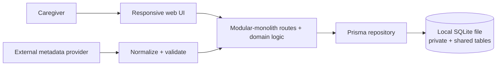
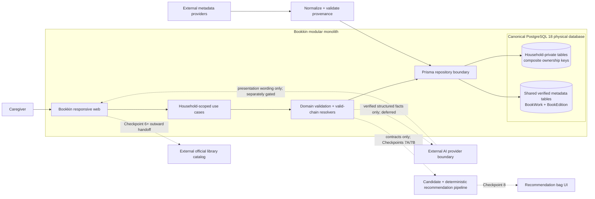
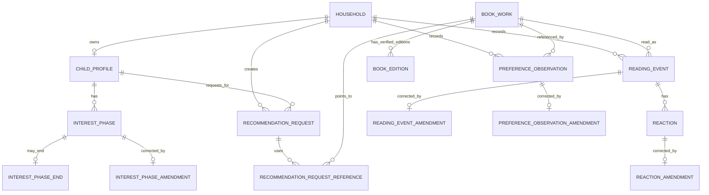
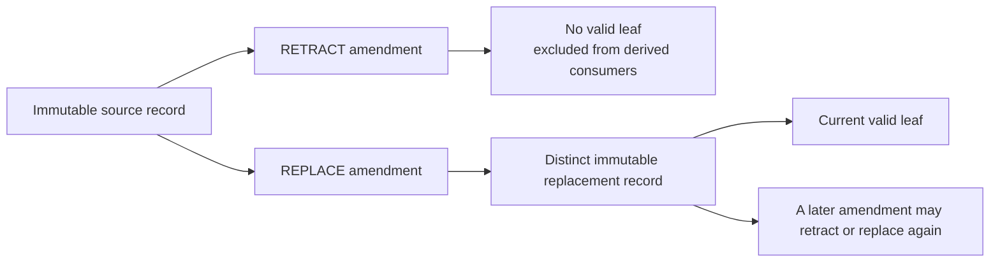

# Checkpoint 5B phase-one proposal

Status: APPROVED on 2026-08-15 for bounded Checkpoint 5B phase-two implementation

Authorization: the owner approved this proposal and its recommended decisions on 2026-08-15. The bounded phase-two implementation described here is authorized. Commit/push, deployment, Checkpoint 6, and user-facing Quick Log implementation before its separate interactive design gate remain unauthorized.

## Recommended decision set

1. Make PostgreSQL 18 the canonical local, CI, and future hosted database.
2. Use the already installed Docker Desktop plus a checked-in Docker Compose PostgreSQL service for Windows development. Keep the official native Windows installer as the documented fallback; do not make WSL a separate supported path.
3. Treat the ignored local SQLite database as disposable development data after creating a private rollback copy. Do not automatically import it. Offer a separately reviewed one-time importer only if the owner identifies local records that must be retained.
4. Start one new PostgreSQL-specific migration history. Preserve the SQLite SQL history outside Prisma's active migration directory for audit because Prisma migration SQL cannot be reused across providers.
5. Freeze the evidence, correction, request, candidate, deterministic score, composition, explanation, and bag-result contracts below before implementation.
6. Use dedicated, foreign-keyed amendment records rather than one polymorphic amendment table.
7. Keep Checkpoint 5B implementation bounded to the approved database transition, contracts, correction use cases, typed result, tests, and the separately reviewed Quick Log reread/Undo refinement.

## Current and proposed architecture

Legend: private records contain child-linked household evidence; shared records contain verified book metadata without household meaning; external systems remain untrusted until normalized. Dotted paths are deferred contracts, not Checkpoint 5B implementation.

### Current topology

Current callout: one ignored local SQLite file physically mixes household-private records and shared verified metadata. Ownership is primarily enforced in application code, and CI has no canonical database service.

### Proposed Checkpoint 5B topology

Decision callouts:

1. PostgreSQL replaces SQLite as the one canonical local/CI/future-hosted database family, while private and shared records remain logically distinct inside that physical database.
2. Household ownership is enforced in both use cases and composite database keys.
3. External metadata providers cannot write product facts directly; normalization and provenance validation precede shared metadata persistence.
4. Candidate sourcing, scoring, composition, bag UI, library capabilities, and AI implementation are not pulled into Checkpoint 5B.

## Proposed entity relationships

This diagram shows the ownership and evidence spine, not every index or audit timestamp. Every household-owned child/link record also carries `householdId` for composite foreign-key enforcement.

Bag, item, candidate, score, composition, explanation, and recommendation-action persistence is intentionally absent from the Checkpoint 5B entity diagram; those records are deferred to their named later checkpoints.

Correction lifecycle:

The amendment and a distinct replacement record are created atomically; a superseded source never turns into or transfers identity to its replacement. Only the current valid leaf contributes to views, counts, new recommendation snapshots, explanations, or attribution. Household privacy deletion is a separate cascading operation.

## Contract conventions

- `Household` remains the private ownership and authorization boundary.
- `BookWork` remains shared verified metadata; household evidence points to a work without creating a shelf record.
- Closed taxonomies use database enums plus matching Zod schemas. Provider identifiers and version identifiers remain validated strings.
- `AgeStageBandV1` is a discriminated value: `{ basis: "age", value: "2_3" | "4_5" | "6_8" }` or `{ basis: "reading_stage", value: "pre_reader" | "emergent_reader" | "early_independent" }`. It stores no exact birthdate and is an owner-approved input, not an inferred assessment.
- Household mutations accept a caller-generated `clientMutationId`; the database enforces uniqueness per household and mutation family.
- Domain records use UTC instants stored as PostgreSQL `timestamptz(3)` and localized only for display.
- Private structured snapshots use PostgreSQL `jsonb` only behind versioned Zod schemas. They never become unvalidated arbitrary payloads.
- Subject, reporter, source, occurrence time, and declaration time are separate concepts.
- Ordinary correction is append-only. Privacy deletion remains a distinct cascading operation.
- A record contributes to current views only when it is the valid leaf of its amendment chain.
- Household-owned links use composite foreign keys that include `householdId`; matching IDs are not trusted as proof of matching ownership.

## Frozen taxonomies

### Evidence provenance

- Observation subject: `child`, `caregiver`, `family_reference`.
- Reporter: `caregiver`, `child_direct`, plus migration-only `unknown_legacy` if the owner later authorizes legacy import.
- V0.1 writers create `caregiver` reports only. `child_direct` is reserved and rejected unless a later approved interaction supplies direct-child provenance.
- Preference kind: `worked_for_us` only.
- Declaration source: `explicit_preference`, with an interaction-version string.
- Request-reference purpose: `more_like_this` only.

### Reading and corrections

- Reading event: `finished`, `reread`, `stopped`, `rejected`.
- Consumer wording for `rejected`: `Decided not to read`.
- Amendment kind: `retract`, `replace`.
- Recommendation action: `saved`, `not_for_us`, `catalog_opened`, `replacement_requested`, `reading_attributed`.
- Borrowed/returned and child/caregiver selection are not reading events or recommendation outcomes.

### Recommendation result

- Result type: `normal`, `limited_verified_pool`, `no_eligible_candidates`.
- Evidence state: `sufficient`, `limited`.
- Composition role: `core_match`, `adjacent_discovery`, `historical_revisit`.
- Limited/zero reason: `verified_pool_exhausted`, `exclusions_reduced_pool`, `provider_coverage_limited`.
- A provider outage that prevents a trustworthy completed pool is an application error, not a completed bag result and not a no-candidate result.

## PreferenceObservation contract

Required fields:

| Field | Rule |
| --- | --- |
| `id`, `householdId`, `childId`, `workId` | The child belongs to the household; the work is verified. |
| `kind` | `worked_for_us`. |
| `subjectType` | `child`, `caregiver`, or `family_reference`. |
| `reporterType` | V0.1 writes `caregiver`; subject and reporter never collapse into one field. |
| `declaredAt`, `createdAt` | Declaration and persistence times remain distinct. |
| `sourceType`, `sourceVersion` | Explicit declaration and the approved interaction/contract version. |
| `clientMutationId` | Unique with `householdId` for idempotency. |

Rules:

- A child-subject observation defaults to caregiver-reported.
- `family_reference` remains one weaker family-level signal; it is never expanded into child and caregiver reactions.
- Reading time remains unknown unless a separate valid `ReadingEvent` exists.
- Creation performs no implicit shelf, status, history, reaction, finish, reread, borrowing, or recommendation-action write.
- A replacement is a new complete observation linked by `PreferenceObservationAmendment`; the original remains immutable.

## Reaction provenance contract

Required fields:

| Field | Rule |
| --- | --- |
| `id`, `householdId`, `readingEventId` | Composite ownership keys require the event and reaction to share the household. |
| `subjectType` | `child` or `caregiver`. |
| `value` | Child: `love`, `like`, `not_for_me`. Caregiver: `love`, `like`, `dislike`. |
| `declaredAt`, `createdAt` | Original declaration time remains separate from persistence time. |
| `reporterType` | V0.1 writers use `caregiver`; `child_direct` is reserved; `unknown_legacy` is migration-only. |
| `sourceType` | `quick_log`, `reaction_correction`, or `correction_carry_forward`. |
| `sourceVersion`, `clientMutationId` | Versioned provenance and household-scoped idempotency. |

Carry-forward creates a distinct reaction with the same subject, value, `declaredAt`, and reporter, uses `sourceType=correction_carry_forward`, and links old to new through `ReactionAmendment`. Newly changed values use a new declaration time and `sourceType=reaction_correction`. The unstructured historical `tags` field is retired rather than promoted into evidence. Under the recommended discard/reseed path, no legacy reaction is migrated. Any later approved importer must use `unknown_legacy` rather than inventing a reporter and must preserve the original `createdAt` as the only known time.

## RecommendationRequestReference contract

Required fields:

| Field | Rule |
| --- | --- |
| `id`, `householdId`, `requestId`, `workId` | Request and reference share the household; the work is verified. |
| `purpose` | `more_like_this`. |
| `selectedAt`, `sourceVersion` | Explicit request-scoped selection and interaction version. |
| `clientMutationId` | Unique with `householdId`; repeated submission returns the same logical result. |

Constraints:

- Unique `(requestId, workId, purpose)`.
- No shelf, status, reading event, reaction, durable observation, or borrowing side effect.
- Converting a request reference into durable evidence requires a later explicit `PreferenceObservation` command.
- References are retained with the request for repeatability and deleted with the household.

## Interest-history contract

`InterestPhase` is a household-owned declaration with:

- `id`, `householdId`, `childId`.
- A normalized but user-authored `label` with a short bounded length; it is private content and prohibited from analytics.
- `startedAt`, `declaredAt`, `reporterType`, `sourceVersion`, and `clientMutationId`.
- An optional one-to-one `InterestPhaseEnd` records a legitimate end with `endedAt`, declaration time, reporter, provenance, and its own idempotency key. Ending an interest is normal history, not a correction.
- A valid phase without a valid end is current; a valid phase with a valid end is historical.
- Re-entering the same topic creates a new phase.
- A mistaken label or time range is corrected by replacement; a wholly incorrect phase is retracted.
- Checkpoint 5B freezes identity and validity only. Historical decay and recommendation weights remain Checkpoint 7B.

The existing serialized `ChildProfile.currentInterests` field is retired only after approved migration. No value is parsed or guessed unless it passes the approved legacy shape and is explicitly covered by the migration decision.

## Source-preserving amendment contract

Use four dedicated tables:

- `ReadingEventAmendment`
- `ReactionAmendment`
- `PreferenceObservationAmendment`
- `InterestPhaseAmendment`

Every amendment contains:

- `id`, `householdId`, `kind`, `targetId`, optional `replacementId`, `declaredAt`, `reporterType`, `reasonCode?`, and `clientMutationId`.
- Unique target: one direct amendment per record.
- Unique non-null replacement: a replacement can belong to only one chain.
- `retract` requires no replacement; `replace` requires one. This is enforced with reviewed PostgreSQL checks in migration SQL and repeated in application validation.
- Target and replacement must share household and record-specific identity invariants.
- An `InterestPhaseEnd` is corrected or retracted through the owning interest phase's replacement chain; phase-end edits never silently mutate the original declaration.
- The application creates the replacement and amendment atomically.
- Resolving a chain detects cycles, missing links, cross-household links, and multiple leaves as integrity failures rather than guessing.

Specific rules:

- A retracted reading event leaves history, reread counts, taste inputs, explanation sources, and recommendation attribution immediately.
- A replacement reading event is a new event with a distinct ID. Existing reactions never change parent identity and never transfer silently.
- In the same correction transaction, every currently valid reaction on the superseded event is either (a) carried forward as a distinct reaction linked by a `replace` reaction amendment while preserving original declaration/reporter provenance, (b) replaced with newly declared values, or (c) retracted. The correction command must account for every valid reaction; the use case cannot drop one by omission.
- If only a reaction is wrong, a reaction amendment corrects that reaction without replacing the reading event.
- A reaction attached to an invalid reading event is invalid even if the reaction itself has no amendment.
- Recommendation attribution can link only to a currently valid `finished` or `reread` event.
- Recommendation actions are a future append-only contract. Their persistence and disposition resolver are not implemented in Checkpoint 5B; the stale historical table is retired during the reseed transition.

## RecommendationAction boundary contract

Checkpoint 5B freezes this future boundary so later scoring does not reuse reading or shelf concepts as recommendation actions:

- Required common fields: `id`, `householdId`, `requestId`, `workId`, `actionType`, `declaredAt`, `createdAt`, and `clientMutationId`.
- Closed action types: `saved`, `not_for_us`, `catalog_opened`, `replacement_requested`, `reading_attributed`.
- Composite foreign keys require the request and any linked reading event to share `householdId`; `workId` must match the request item and any attributed reading event.
- `reading_attributed` alone requires `readingEventId`, and it must reference a currently valid `finished` or `reread` event. All other action types forbid `readingEventId`.
- `replacement_requested` records the outgoing work only; the later replacement result remains a separate request/result fact.
- `(householdId, clientMutationId)` is unique. Deterministic current disposition for one request/work uses the latest `saved` or `not_for_us` by `(declaredAt, createdAt, id)`.
- Borrowing, scanning, finishing, rereading, stopped reading, and deciding not to read remain separate encounter, shelf, or reading facts.

No `RecommendationAction` schema or use case is implemented in Checkpoint 5B; that work is deferred to Checkpoint 8. Checkpoint 5B only removes the stale incompatible historical model during the approved disposable-data transition.

## Recommendation request and evidence snapshot

Replace the historical `RecommendationBatch` concept now with `RecommendationRequest`. The completed bag remains a frozen domain result contract until Checkpoint 7B supplies real scored items.

### RecommendationRequest

- `id`, `householdId`, `childId`, `requestedAt`, `clientMutationId`.
- `ageStageBand` using the exact `AgeStageBandV1` contract.
- `evidenceSnapshotVersion` fixed to `request-evidence-v1` and validated private `evidenceSnapshot` JSON.
- `request-evidence-v1` contains `ageStageBand`, sorted/deduplicated `currentInterestPhaseIds`, `historicalInterestPhaseIds`, `preferenceObservationIds`, `readingEventIds`, `reactionIds`, and `requestReferenceIds`. It contains no free-form copied titles, labels, reactions, explanation text, or recommendation-action placeholders.
- The snapshot is authoritative for repeatability; later corrections affect later requests but do not rewrite a historical request.
- A retracted source remains auditable but must not be copied into a new snapshot.
- The minimum request context is intentionally small: one coarse age/reading-stage band plus at least one valid current interest, valid durable `PreferenceObservation`, or verified request reference. Shelf setup, five logs, reactions, reasons, and reconstructed history are never prerequisites for first value.

### RecommendationBag deferral boundary

Checkpoint 5B implements only the discriminated domain validator in the typed bag-result section below. It does not add `RecommendationBag`, candidate, score, composition, explanation, or item persistence and cannot create a completed bag. Those records and exact payload schemas are frozen after candidate work in Checkpoint 7A and scoring/composition work in Checkpoint 7B. A provider failure never becomes a completed result.

## Candidate boundary contract

A normalized candidate is not a title string. It contains:

- Verified `workId` and provider record provenance.
- Field coverage with explicit available and missing attributes.
- Canonical-work/deduplication evidence and merged provider record IDs.
- Eligibility state with deterministic inclusion checks and controlled exclusion reasons.
- No household shelf or history side effect.

Candidate providers, hydration, persistence, coverage-field vocabulary, eligibility-check vocabulary, and exclusion-code vocabulary are Checkpoint 7A decisions and must not be implemented in Checkpoint 5B. Checkpoint 5B freezes only the invariants above and the rule that later candidate evidence must use a versioned validated schema rather than arbitrary JSON.

## Deterministic score contract

`RecommendationScore` uses integer basis points rather than floating-point totals:

- `totalBps`.
- Ordered `signals` with `signalType`, evidence source IDs, polarity, raw normalized value, `weightBps`, `contributionBps`, and scoring version.
- Missing metadata contributes zero and remains explicitly missing; it is never inferred negatively.
- Signal types are exactly `child_preference`, `caregiver_preference`, `family_reference`, `current_interest`, `historical_interest`, `reread`, `stopped`, `decided_not_to_read`, `not_for_us`, and `request_reference`.
- Fixed inputs and versions must produce byte-equivalent structured scores.

Weights, normalization, source aggregation, suppression thresholds, and score persistence remain Checkpoint 7B owner decisions and must not be implemented in Checkpoint 5B.

## Composition contract

- Composition operates only on verified eligible scored candidates.
- Roles are `core_match`, `adjacent_discovery`, and `historical_revisit`.
- A role is descriptive and versioned; it never bypasses eligibility, exclusions, deduplication, or a future approved score floor.
- The composer targets five but never pads.
- A role with no trustworthy candidate is omitted rather than filled artificially.
- Exact role quotas remain Checkpoint 7B.
- Composition execution and persistence remain Checkpoint 7B and must not be implemented in Checkpoint 5B.

## Deterministic explanation contract

Persist a structured explanation, not only prose:

- `version` and a controlled summary key.
- Ordered clauses with a clause kind, source record IDs, controlled fact key, and bounded parameters.
- Optional uncertainty clauses for material missing metadata or limited evidence.
- Allowed evidence kinds mirror the separate score signals.
- Family references cannot be worded as child or caregiver love.
- Historical interests cannot be called current or favorite.
- A single log cannot be promised to improve recommendations.
- Explanations cite only verified metadata or explicitly declared, currently valid evidence.

V0.1 renders deterministic copy. No LLM is required or authorized.

The controlled summary keys, clause kinds, fact keys, parameter schemas, uncertainty rules, rendering copy, and persistence shape are Checkpoint 7B decisions and must not be implemented in Checkpoint 5B.

## Typed bag-result contract

Checkpoint 5B freezes a domain-only discriminated union with common `requestId`, `resultType`, `evidenceState`, `targetCount`, `actualCount`, and ordered distinct `workIds`.

- `evidenceState` is exactly `sufficient` or `limited`. The calculation threshold is a Checkpoint 7B decision; Checkpoint 5B validates but never assigns it.
- `targetCount` is exactly 5 in V0.1.

- `normal`: exactly 3-5 ordered items, target 5.
- `limited_verified_pool`: exactly 1-2 ordered items plus a controlled reason.
- `no_eligible_candidates`: zero work IDs plus a controlled reason.

`actualCount` must equal the work-ID count. Work IDs are distinct and reference verified works. Limited/zero reasons are exactly `verified_pool_exhausted`, `exclusions_reduced_pool`, or `provider_coverage_limited`. Candidate-coverage summaries, recovery hints, item evidence, scores, roles, explanations, and all persistence are deferred to Checkpoints 7A, 7B, and 8 and must not be implemented in Checkpoint 5B.

## Proposed PostgreSQL model changes

The approved implementation schema should include or change these records:

| Record | Required change |
| --- | --- |
| `ChildProfile` | Make nickname optional; remove `birthMonthYear`; replace serialized current interests with `InterestPhase`. |
| `ReadingEvent` | Closed event enum, household idempotency key, and amendment relation. |
| `Reaction` | Rename `parent` to `caregiver`; add household ownership, declaration/reporter/source/idempotency provenance; retire unstructured tags; support amendment chains rather than a permanent event/subject uniqueness assumption. |
| `PreferenceObservation` | New durable evidence record. |
| `InterestPhase` | New current/historical interest record. |
| `InterestPhaseEnd` | New one-to-one legitimate-end declaration, separate from correction. |
| Four amendment tables | Dedicated target and replacement foreign keys plus check constraints. |
| `RecommendationRequest` | Request identity, minimum context, idempotency, and evidence snapshot. |
| `RecommendationRequestReference` | Request-scoped verified work reference. |
| Historical recommendation records | Remove the stale batch/item/action schema during the approved disposable-data transition; preserve no unapproved recommendation history. Add only the domain-level typed result and future action contracts above. |

All household-owned query paths lead with `householdId`. Household-owned parent records expose composite unique keys such as `(id, householdId)`, and child/link records use composite foreign keys so the database rejects cross-household combinations. Application commands still verify household, child, work/edition encounter where required, target, and replacement ownership in one transaction. Shared `BookWork` and `BookEdition` metadata is not deleted merely because one household is deleted.

## Retention, deletion, and export boundary

Recommended V0.1 policy:

- Keep valid and corrected household evidence, request references, correction lineage, and any bags persisted by later checkpoints until the household is deleted. This supports repeatability without creating a second retention scheduler during alpha.
- Household privacy deletion cascades through all private evidence, references, snapshots, correction lineage, and bags. Auditability never overrides deletion.
- Do not send titles, ISBNs, child nickname, interest labels, raw evidence, request snapshots, or correction reasons to analytics or ordinary logs.
- Keep these records typed and household-scoped so a later deterministic export is possible. Checkpoint 5B adds no export contract or UI; operational retention/export instructions and any shorter time-based policy remain an explicit Checkpoint 10 decision.

## PostgreSQL decision

### Recommended Windows-local method

Use Docker Compose with a pinned PostgreSQL 18 image, a named development volume, health check, separate development and test databases, and local-only placeholder credentials. Docker 29.1.3 is installed on the current workstation, although the Docker Desktop daemon was not running during this audit. No account or image pull is authorized in phase one.

Why this is preferred:

- Matches the GitHub Actions service-container topology.
- Gives agents reproducible start, health, reset, backup, and restore commands.
- Avoids requiring a separately installed `psql` client; database tools can run inside the container.
- Keeps native Windows installation as a fallback rather than a second canonical workflow.

Alternatives:

1. Native PostgreSQL Windows installer: supported fallback for users who cannot run Docker; lower idle overhead, but more machine-specific service, PATH, port, upgrade, and cleanup behavior.
2. WSL-hosted PostgreSQL: not recommended as a supported project path because it adds a second shell/filesystem/network boundary and WSL status access failed during this audit.
3. Local Prisma Postgres: not recommended as canonical because it introduces a Prisma-specific local service and a less direct match to a future vendor-neutral managed PostgreSQL target.

PostgreSQL 18 is the current supported major through November 2030. Pin the current reviewed minor/image tag during implementation and update it deliberately; never use `latest`.

## SQLite disposition

Facts:

- `prisma/dev.db` exists locally, is ignored by Git, and is 262,144 bytes.
- The seed contains a synthetic household and no seeded book metadata, but interactive development has added local records.
- No production or external household database exists in the repository evidence.

Recommended disposition:

- Before cutover, create a private timestamped copy and checksum outside Git.
- Record table counts only in migration evidence; never print private field values.
- Do not automatically import the file.
- Initialize PostgreSQL from the approved minimal seed and verified test fixtures.
- Retain the private SQLite copy through Checkpoint 5B acceptance, then let the owner decide when to delete it.

If the owner requires preservation, phase two must add a separately reviewed one-time importer with dry-run counts, explicit mappings, rejected-row output without sensitive content, idempotency, and source/target reconciliation. Historical recommendation rows are not imported because that workflow was never approved as product truth.

## Migration sequence

One domain/data agent owns `prisma/schema.prisma` and the active migration history from start through merge.

1. Create private SQLite backup/checksum and read-only counts.
2. Accept the correction and PostgreSQL ADRs.
3. Move the SQLite provider history to an audit-only directory outside `prisma/migrations`; do not rewrite its SQL.
4. Change the canonical datasource to PostgreSQL and apply the approved schema.
5. Generate a new PostgreSQL baseline from empty with `migrate diff`, review every SQL statement, add only approved check constraints, and commit the complete provider-specific history.
6. Add Docker Compose, safe `.env.example` placeholders, literal Windows start/stop/reset/backup/restore commands, and remove the SQLite-only migration fallback.
7. Run `prisma validate`, generate the client, apply `migrate deploy` to a fresh local database, seed, and run the full suite.
8. Add integration tests for migrations, household isolation, idempotency, side-effect absence, and amendment-chain validity.
9. Add a PostgreSQL service container to GitHub Actions and run `migrate deploy` before integration tests. CI never uses `migrate dev`.
10. Rehearse rollback against disposable databases and preserve the logs as acceptance evidence.

Prisma migrations are provider-specific; the SQLite SQL history cannot be used for PostgreSQL. `migrate dev` uses a shadow database and belongs only in development. Staging/production-style environments use `migrate deploy`.

## Rollback plan

Before any external household data exists:

- Stop writes.
- Preserve the PostgreSQL database/volume and logs.
- Restore the previous Git revision and private SQLite backup if the transition itself must be abandoned.
- Never dual-write or silently copy back from PostgreSQL to SQLite.

After PostgreSQL becomes canonical:

- Prefer a forward corrective migration.
- Roll application code back only when the applied schema is backward-compatible.
- For destructive corruption or an incompatible initial transition, restore the tested PostgreSQL backup to a new database, verify counts and invariants, then switch the connection.
- Never run reset/drop commands against a target that has not been resolved and verified as the disposable local or CI database.

## CI proposal

- Keep the existing lint, typecheck, unit-test, and build job.
- Add a pinned PostgreSQL 18 service with a health check on Ubuntu.
- Use separate non-secret CI credentials and database names.
- Run `prisma validate`, `prisma generate`, `prisma migrate deploy`, seed only verified fixtures, and integration tests.
- Add a fresh-database replay test and a migration-status/drift check.
- Add a rollback rehearsal job or script that operates only on a disposable CI database.
- Do not provision a hosted database in Checkpoint 5B; hosted vendor/account/cost approval remains Checkpoint 8A.

## Blocking debt included in phase two

- SQLite provider and provider-specific migration history.
- SQLite-only migration fallback script.
- Broad historical reading-event and recommendation-action taxonomies.
- Missing correction/retraction persistence and valid-chain resolvers.
- Missing durable preference observations and request-scoped references.
- Current-only serialized interests with no historical phases.
- Historical recommendation tables that cannot represent typed results, evidence state, coverage, versions, roles, or structured explanations.
- Required nickname and retained `birthMonthYear`, which conflict with the approved minimal profile.
- Missing household idempotency keys and cross-record ownership tests.
- CI without PostgreSQL migration/integration evidence.

## Explicit exclusions

- Candidate-provider, hydration, scoring, composition, or recommendation UI implementation.
- Profile/current-interest UI.
- General schema cleanup unrelated to recommendation integrity.
- Library UI or adapter implementation.
- AI or LLM code.
- Analytics, public acquisition, authentication, multiple households, or multiple children.
- Hosted database/vendor/account creation, deployment, secrets, or costs.
- Camera scanning.
- User-interface work other than the later, separately prototyped Quick Log reread confirmation and correction-backed Undo.

## Agentic implementation sequence after approval

1. Lead freezes this decision set and assigns one domain/data writer.
2. Domain/data writer alone edits the schema, active migration history, database scripts, Compose file, and correction ADR status.
3. A migration reviewer independently checks generated and custom SQL, backup, restore, rollback, destructive-target guards, and provider-history separation.
4. Domain-contract worker implements pure validators and resolvers after generated Prisma types stabilize.
5. Application worker implements household-scoped observation, reference, interest, and amendment use cases plus the domain-only typed-result validator against frozen contracts.
6. Test worker adds disjoint domain/integration fixtures and side-effect, correction, idempotency, and isolation tests.
7. Before the only user-facing change, the lead presents an interactive Quick Log reread/Undo prototype for owner review. A UI writer implements it only after that design gate.
8. Privacy and staff-engineering reviewers perform read-only passes; the lead integrates findings and runs local plus CI verification.
9. The lead presents the required Checkpoint 5B implementation report and stops. No commit/push or Checkpoint 6 begins without explicit owner approval.

## Phase-two acceptance tests

- Creating a request reference creates exactly one reference and no shelf, status, reading, reaction, borrowing, or preference record.
- Creating a preference observation creates exactly one durable observation and no implicit reading/shelf facts.
- One coarse age/stage band plus at least one current interest, valid durable preference observation, or verified request reference is sufficient to create a recommendation request; no shelf or history minimum is enforced.
- Cross-household target, replacement, request, child, work, and attribution links are rejected.
- Composite-foreign-key tests prove mismatched household links fail at the database boundary as well as the use-case boundary.
- Duplicate `clientMutationId` submissions are idempotent.
- Retracted and superseded events leave timelines, reread counts, taste snapshots, score inputs, explanations, and attribution.
- Retracted/superseded reactions, observations, and interests leave new request snapshots immediately.
- Replacing a reading event accounts for every valid reaction through explicit atomic carry-forward, replacement, or retraction; no reaction changes parent identity or disappears by omission.
- Historical requests remain reproducible from their immutable snapshots.
- Typed result/count invariants reject padding, duplicate work IDs, invalid reason/count combinations, and provider failures disguised as no-candidate results.
- PostgreSQL migrations replay from empty in local and CI environments.
- Backup/restore and rollback rehearsals verify counts and constraints on disposable databases.
- Current Add, Shelf, History, and ordinary Quick Log regression tests remain green.

## Owner decisions required

1. Approve PostgreSQL 18 as canonical.
2. Approve Docker Compose as the primary Windows-local method, with native installer fallback.
3. Choose SQLite disposition: private backup then discard/reseed (recommended), or authorize a bounded one-time importer.
4. Approve the exact evidence, correction, interest, request, age/stage, future-action, candidate-boundary, score-boundary, composition-boundary, explanation-boundary, and domain-only bag contracts plus their explicit later-checkpoint deferrals.
5. Approve the proposed schema record set and privacy cleanup (`birthMonthYear` removal and optional nickname), including removal of the stale recommendation tables with no replacement persistence in 5B.
6. Approve the bounded debt list and exclusions.
7. Approve the single-writer implementation sequence and the separate Quick Log design gate.
8. Approve retaining private request/evidence/correction records until household deletion for V0.1, with no sensitive analytics/logging and export contract/UI deferred to Checkpoint 10.

## Primary sources checked

- [Prisma PostgreSQL connector](https://docs.prisma.io/docs/orm/v6/overview/databases/postgresql)
- [Prisma Migrate provider-switch limitation](https://docs.prisma.io/docs/orm/prisma-migrate/understanding-prisma-migrate/limitations-and-known-issues)
- [Prisma migrate dev and shadow database](https://docs.prisma.io/docs/cli/migrate/dev)
- [Prisma migrate deploy](https://docs.prisma.io/docs/cli/migrate/deploy)
- [Prisma Docker/PostgreSQL guide](https://www.prisma.io/docs/guides/deployment/docker)
- [Docker Desktop for Windows](https://docs.docker.com/desktop/setup/install/windows-install/)
- [PostgreSQL version policy](https://www.postgresql.org/support/versioning/)
- [GitHub Actions PostgreSQL service containers](https://docs.github.com/en/actions/tutorials/use-containerized-services/create-postgresql-service-containers)
