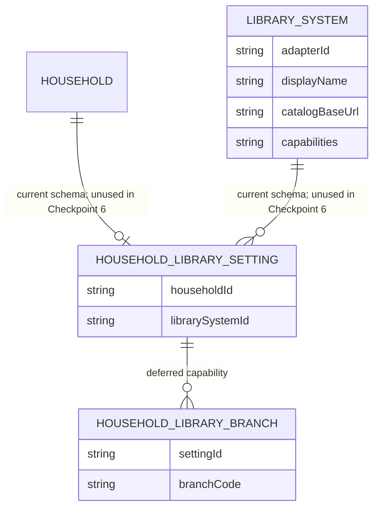

# Checkpoint 6 library-adapter proposal

Status: approved by the human product owner on 2026-08-15; bounded Checkpoint 6 implementation is authorized. Final checkpoint approval is still required before commit, push, or Checkpoint 7A.

## Decision requested

Approve a narrow, link-producing adapter boundary for the private household alpha:

- Johnson County Library is the single configured alpha library system. No household setting is written yet.
- `catalog_search` is the only supported capability.
- Bookkin constructs an official Johnson County Library catalog URL; it does not fetch, scrape, interpret, cache, or proxy catalog results.
- A valid normalized ISBN is the primary search. A normalized non-empty title is a separately constructed fallback link.
- Because Bookkin does not inspect catalog results, fallback is user-invoked rather than an automatic claim that the ISBN search failed.
- Unsupported capabilities, unknown adapter IDs, and unusable inputs return typed outcomes instead of fabricated links or generic exceptions.
- Persisted `catalogBaseUrl` and capability strings are descriptive data, not trusted navigation configuration. A known adapter ID resolves to code-owned capabilities and a hard-coded HTTPS origin.

This keeps the modular-monolith boundary small and leaves branch selection, account access, availability, holds, and borrowing history outside Bookkin.

## Verified external behavior

The official Johnson County Library catalog is `https://jocolibrary.bibliocommons.com`. Its current result URLs use this form:

```text
https://jocolibrary.bibliocommons.com/v2/search?query=<encoded query>&searchType=smart
```

BiblioCommons' official catalog help says an exact ISBN can be entered in the search box as a keyword. It also describes ordinary title/keyword searches. The implementation will rely only on this documented search handoff, not on result-page markup or inferred availability.

Evidence checked on 2026-08-15:

- [Johnson County Library official catalog search](https://jocolibrary.bibliocommons.com/search)
- [BiblioCommons official searching guidance](https://help.bibliocommons.com/hc/en-us/articles/31765683992084-Searching-for-Titles)

The catalog URL is an external contract and can change. Its exact host, HTTPS protocol, path, and query parameters therefore receive regression tests and an owner-visible operations note.

## Proposed contract

The application port belongs under `src/application/libraries/`. Johnson County-specific URL construction belongs under `src/infrastructure/libraries/`.

```ts
type LibraryCapability = "catalog_search";

type CatalogSearchInput = {
  isbn?: string;
  title?: string;
};

type CatalogSearchLink = {
  adapterId: string;
  queryKind: "isbn" | "title";
  normalizedQuery: string;
  url: string;
};

type CatalogHandoffResult =
  | {
      status: "ready";
      librarySystemId: string;
      librarySystemName: string;
      primary: CatalogSearchLink;
      fallback?: CatalogSearchLink;
    }
  | {
      status: "unsupported";
      capability: LibraryCapability;
    }
  | {
      status: "invalid_input";
      reason: "missing_search_term" | "invalid_isbn";
    };

interface CatalogSearchCapability {
  createHandoff(input: CatalogSearchInput): CatalogHandoffResult;
}

interface LibraryAdapter {
  readonly id: string;
  readonly displayName: string;
  readonly capabilities: Readonly<{
    catalogSearch?: CatalogSearchCapability;
  }>;
}
```

The exact exported names may be tightened during implementation, but these semantics are frozen if the proposal is approved:

1. Reuse the existing domain ISBN validator and canonical ISBN normalization.
2. Normalize titles to Unicode NFC, trim them, and collapse whitespace while preserving case, punctuation, diacritics, and words.
3. Prefer a valid ISBN.
4. Include a title fallback only when a usable verified-metadata title differs from the ISBN query. Do not accept household IDs, child data, reactions, notes, credentials, or arbitrary metadata spreads.
5. Never send an invalid ISBN to the catalog. If an invalid ISBN was explicitly supplied, return `invalid_input`; do not silently reinterpret it as a title or conceal a metadata-integrity defect. Do not expose or log the raw invalid value.
6. Build URLs with the platform `URL` and `URLSearchParams` APIs from adapter-owned constants.
7. Require `https:`, the exact allowlisted host, `/v2/search`, and `searchType=smart` in tests.
8. Keep the result pure and synchronous: URL construction makes no network request and records no user action.
9. Resolve only known code-owned adapter IDs. Unknown IDs fail closed; database URL or capability fields never override adapter code.
10. A small application function checks for `capabilities.catalogSearch`; absence returns the typed `unsupported` result without invoking provider work.

## Architecture and trust boundaries

```mermaid
flowchart LR
    subgraph current["Current Bookkin modular monolith — private household boundary"]
        caller["Future approved application use case"]
        port["Proposed LibraryAdapter port<br/>application-owned"]
        joco["Proposed Johnson County adapter<br/>infrastructure-owned"]
        isbn["Current ISBN validation<br/>domain-owned"]
        db[("Current PostgreSQL<br/>library tables remain unused")]
    end

    subgraph external["External public system — not controlled by Bookkin"]
        catalog["Johnson County Library<br/>official BiblioCommons catalog"]
    end

    subgraph deferred["Deferred — unsupported in Checkpoint 6"]
        future["Availability · holds · accounts · branches<br/>loans · history · result ingestion"]
    end

    caller -->|"verified title / ISBN"| port
    port --> joco
    joco --> isbn
    joco -->|"typed handoff: official HTTPS URL"| caller
    caller -. "later-checkpoint user action" .->|"browser navigation only"| catalog
    joco -. "no reads or writes" .-> db
    catalog -. "no scraping, account access, or response ingestion" .-> joco
    joco -. "typed unsupported result" .-> future
```

Current elements are the modular-monolith boundaries, ISBN validation, and PostgreSQL schema. Proposed elements are the application port and Johnson County adapter. The catalog navigation consumer is deferred to Checkpoint 8; Checkpoint 6 tests the handoff object without adding recommendation UI.

## Search lifecycle

```mermaid
stateDiagram-v2
    [*] --> CheckCapability
    CheckCapability --> Unsupported: catalog_search absent
    CheckCapability --> ValidateInput: catalog_search present
    ValidateInput --> InvalidInput: explicit ISBN is invalid
    ValidateInput --> IsbnPrimary: valid ISBN
    ValidateInput --> TitlePrimary: no ISBN and usable title
    ValidateInput --> InvalidInput: neither usable
    IsbnPrimary --> AddTitleFallback: usable title also present
    IsbnPrimary --> Ready: no usable title
    AddTitleFallback --> Ready
    TitlePrimary --> Ready
    Ready --> [*]
    Unsupported --> [*]
    InvalidInput --> [*]
```



`Ready` means only that Bookkin safely constructed an official search link. It does not mean the catalog has a matching record, a copy is available, or a hold can be placed.

## Persistence decision

Checkpoint 5B already created future-facing `LibrarySystem` and `HouseholdLibrarySetting` tables. Checkpoint 6 does not need to mutate or seed them: the private alpha has one approved library adapter, and no user-facing library selection exists yet.



No migration, seed, branch record, or household preference write is proposed. A later owner-gated workflow may activate these records when multiple library systems or branch-aware capabilities are real product needs.

## Truthful handoff language

Approved language remains:

- `Check in library catalog`
- `Open Johnson County Library catalog`
- `Availability is checked in the library catalog.`
- For a fallback action: `Search the catalog by title`

Forbidden claims include `Available now`, an in-Bookkin `Place hold`, `Your checkouts`, or any implication that opening a catalog link marks a book borrowed.

## Implementation sequence after approval

1. A single contract writer adds the application port and typed outcomes.
2. A provider-integration implementer adds the Johnson County adapter using existing ISBN validation and platform URL APIs.
3. Unit tests cover ISBN normalization, Unicode/title encoding, ordered fallback links, invalid input without raw-value exposure, unknown adapters, absent `catalogSearch` capability, exact official host/path/protocol, query-parameter injection attempts, and absence of network calls.
4. Documentation records the external URL contract and manual re-verification procedure.
5. An independent product-truth/security reviewer checks wording, allowlisting, privacy, and unsupported states.
6. An independent provider reviewer checks boundary placement and contract conformance.
7. The lead runs the complete relevant validation and presents the Checkpoint 6 report. Technical PASS does not authorize commit, push, deployment, or Checkpoint 7A.

## Explicit exclusions

- No recommendation, bag, shelf, or settings UI.
- No interactive design prototype; this checkpoint has no user-facing screen. Checkpoint 8 owns the catalog-handoff UI and its required interactive review.
- No catalog scraping, API reverse engineering, availability parsing, hold placement, login, credentials, card number, PIN, loans, or history.
- No preferred-branch UI or branch filtering.
- No analytics event.
- No database migration or persistence activation.
- No deployment or hosted resource.

## Owner gate

Implementation waits for explicit product-owner approval of:

1. Johnson County Library as the single private-alpha adapter with no persisted setting yet.
2. User-invoked title fallback, because Bookkin intentionally does not inspect catalog results.
3. The typed `ready` / `unsupported` / `invalid_input` semantics.
4. The handoff language above.
