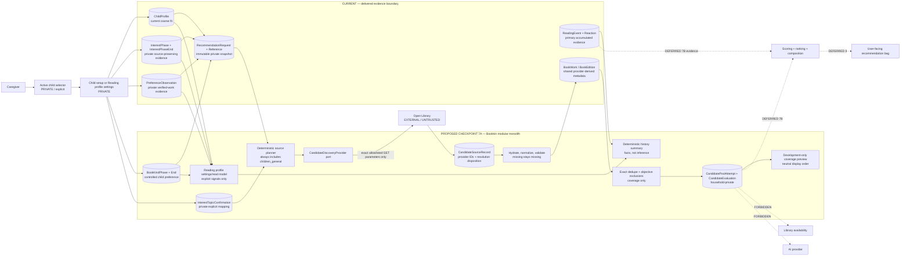
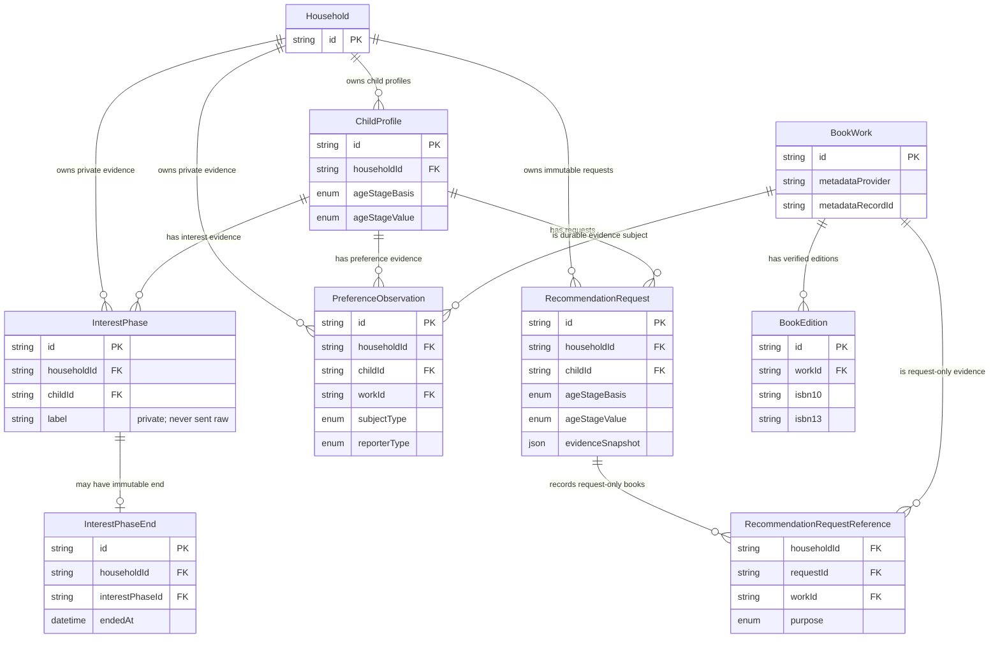
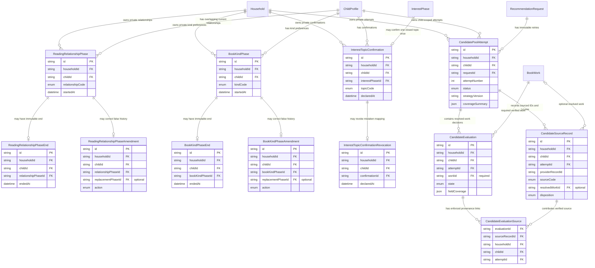

# Checkpoint 7A phase-one proposal

Status: awaiting human product-owner review. This document does not authorize schema changes, implementation, provider expansion, deployment, provisioning, external actions, Checkpoint 7P, or Checkpoint 7B.

## Decision requested

Approve a bounded family-context and verified-candidate architecture:

1. A household may contain multiple caregiver-managed `ChildProfile` rows. Every history view, explicit preference, recommendation request, candidate pool, and future bag has one explicit child boundary; Checkpoint 7A never combines siblings.
2. Each `ChildProfile` holds one current age range and one or more nonexclusive reading-relationship phases. Each recommendation request copies both immutably; Bookkin does not infer a developmental assessment or progression.
3. Existing source-preserving `InterestPhase`, `PreferenceObservation`, `RecommendationRequest`, and `RecommendationRequestReference` contracts remain authoritative. New controlled book-kind phases record preferences such as funny, informative, or fantasy separately from topic interests.
4. Child-profile setup collects coarse fit, current topic interests, and optional kinds of books. The same controls later live under that child’s `Reading profile` settings—not in permanent top-level `Learning` navigation.
5. Reading history, reactions, rereads, and stopped reads remain the primary accumulated recommendation evidence. The Reading profile is a deterministic view/editor of explicit setup/current signals, not the whole recommendation context and not an inferred personality.
6. Free-form interest labels remain private. Every request receives a privacy-safe `children_general` corpus source. A locally exact-matched interest may add one owner-approved `TopicCodeV1` source only after explicit caregiver confirmation. Raw labels, child/household identifiers, age/relationship values, references, reactions, notes, and history never enter provider queries.
7. `More like this book` is request-only behavior shown inside the future recommendation-request flow. It is not a profile-setting action and has no durable preference, shelf, or history side effect.
8. Open Library is the only initial candidate provider. A fallback is proposed separately only if the fixed coverage matrix fails the approved threshold.
9. Candidate sourcing produces immutable private pool attempts and evaluations, not scores, ranks, recommendation items, or bags.

## Existing foundation

Checkpoint 5B already implemented:

- Multiple child rows per household and composite household/child ownership.
- Coarse age/stage validation and immutable request snapshots.
- Current and historical interest phases with end, retract, and replace semantics.
- Durable verified-work preferences with separate subject and reporter.
- Request-scoped verified references with no shelf, history, reaction, or preference side effects.
- Current-evidence snapshots that exclude superseded or retracted records.
- Verified Open Library metadata normalization and field-level coverage.

Checkpoint 7A must not duplicate those contracts. It adds explicit active-child UI/use-case boundaries, controlled book-kind evidence, the child-profile editor/read model, provider-neutral metadata persistence without shelf mutation, and the candidate-pool boundary.

The unstructured `ChildProfile.contentPreferences` field remains unused. It is not evidence and receives no UI. A typed, source-preserving relation replaces that abandoned field for new book-kind evidence.

## Architecture and privacy boundary



Legend:

- The two labeled subgraphs distinguish delivered current records from proposed Checkpoint 7A records and behavior.
- Dashed lines are deferred or forbidden consumers.
- Household context and evidence remain private. Open Library receives only the exact allowlisted query parameters below; no private identifier or raw label is included.

### Privacy decision

The current SDD permits only minimized ISBN, title, or author provider queries and explicitly forbids interest text. Interest-led sourcing therefore requires the following exact amendment.

Recommended amendment after owner approval:

> Candidate discovery may send only the outbound query expression associated with `children_general` or a closed, versioned `TopicCodeV1` that the caregiver explicitly confirmed. It may not send the raw interest label, age/relationship value, household or child identifier, evidence IDs, reference work or title, reactions, notes, history, or combined profile. Every request includes `children_general`, so unmatched or declined interests remain valid context without entering an external query.

Examples:

- Local exact alias `dinosaurs` → offered code `dinosaurs`; it is used only after confirmation.
- Label `construction vehicles with grandpa` does not exactly match an alias, so it remains private and only `children_general` sources candidates.
- An unmatched or declined label remains visible in the Reading profile and never appears in an outbound query.

No query is presented as anonymous. It is merely minimized and unlinked by Bookkin; the external provider controls its own request logs.

### Exact `TopicCodeV1` and outbound-query dictionary

Mapping is local, case-insensitive, whitespace-normalized, and exact against the aliases below. There is no fuzzy match, substring match, telemetry-based match, or AI match. The UI presents the broad topic and requires `Use this broad topic` before `InterestTopicConfirmation` is created. `Not now` or dismissal stores no mapping. A corrected/replaced interest requires a new confirmation. A mistaken confirmation is revoked with an immutable `InterestTopicConfirmationRevocation`; it is never silently overwritten.

Every discovery request is an HTTPS `GET /search.json` with exactly these fixed parameters:

- `q=<allowlisted expression below>`
- `fields=key,title,author_name,edition_key,isbn,language,subject`
- `limit=100`
- `page=1`

No sort, user identifier, request ID, referrer data, custom header value, age/relationship value, or raw household evidence is added. The server-side adapter URL-encodes the fixed expression and rejects any value not present in this dictionary.

| Code | Exact local aliases | Exact outbound `q` expression |
| --- | --- | --- |
| `children_general` | Not derived from an interest; always included | `subject:"juvenile fiction" AND language:eng` |
| `animals` | `animal`, `animals`, `zoo animals` | `subject:animals AND language:eng` |
| `dinosaurs` | `dinosaur`, `dinosaurs` | `subject:dinosaurs AND language:eng` |
| `vehicles` | `trucks`, `trains`, `vehicles`, `things that go` | `subject:vehicles AND language:eng` |
| `construction_vehicles` | `construction vehicles`, `diggers`, `excavators` | `subject:"construction equipment" AND language:eng` |
| `space` | `space`, `planets`, `astronauts` | `subject:space AND language:eng` |
| `weather` | `weather`, `storms`, `snow` | `subject:weather AND language:eng` |
| `ocean` | `ocean`, `sea life`, `underwater` | `subject:ocean AND language:eng` |
| `feelings` | `feelings`, `emotions` | `subject:emotions AND language:eng` |
| `friendship` | `friendship`, `friends` | `subject:friendship AND language:eng` |
| `music` | `music`, `instruments` | `subject:music AND language:eng` |
| `fairy_tales` | `fairy tales`, `folktales` | `subject:"fairy tales" AND language:eng` |
| `humor` | `funny books`, `humor`, `silly stories` | `subject:humor AND language:eng` |
| `bedtime` | `bedtime`, `going to sleep` | `subject:bedtime AND language:eng` |

Reference-led requests never send a reference title, author, ISBN, work ID, or subject verbatim. In Checkpoint 7A they always use `children_general`; reference metadata does not suggest or authorize a topic source. The reference work remains private request evidence for later deterministic matching.

## Child reading-profile behavior

### Multiple child profiles

- The caregiver creates or selects one child profile before entering history, profile settings, requests, or recommendations.
- The selector displays only the optional nickname or a neutral generated label such as `Child 2`; no photo, legal name, school, or birthdate is requested.
- Every route/use case carries `childId` under the current `householdId`; the server never accepts a client-selected child without composite ownership verification.
- History, interests, book-kind preferences, durable observations, requests, candidate attempts, and future bags remain separate per child.
- Switching the active child loads only that child’s profile state and never copies or combines evidence. Remembering a per-child local screen position is optional presentation behavior, not a domain requirement. A combined family bag is deferred.

### Age range and reading relationship

These are separate complementary fields, not alternatives.

- Required single-select age range with no default: `2–3`, `4–5`, or `6–8`. No birthdate is requested.
- Required nonexclusive reading-relationship checkboxes with no defaults: `Read-alouds together`, `Reading together`, and `Some independent reading`.
- Each relationship includes concise behavioral copy and the instruction `Choose all that fit. These can overlap and aren’t a reading assessment.`
- Profile save requires one age range and at least one relationship. Validation focuses the group heading and announces `Choose at least one way books work right now.`

`ChildProfile.ageStageBasis/ageStageValue` cannot truthfully store these independent axes. The schema proposal replaces them with `ageRange` and source-preserving `ReadingRelationshipPhase`/`ReadingRelationshipPhaseEnd` rows. Existing age-basis rows migrate only their verified age value. Legacy reading-stage values do **not** migrate into relationship rows because a reading stage does not establish how a family currently reads together. Missing axes remain missing and require caregiver completion—Bookkin invents no age or relationship. Prior requests keep their historical snapshot values, while new requests snapshot the age range and sorted active relationship codes.

### Interests

- Ordinary entry asks only for a label; Bookkin supplies declaration/start time.
- `Not into this right now` ends a phase and keeps it under `Past interests`.
- `Interested again` creates a new phase rather than reopening the old record.
- `Correct` uses source-preserving replace or retract semantics.
- `Outgrown` is not used.

### Kinds of books they enjoy

These are controlled, optional, nonexclusive child preferences and are not topic interests. V0.1 offers:

- `Funny`
- `Fact-filled or informative`
- `Fantasy`
- `Rhyming or lyrical`
- `Interactive or seek-and-find`
- `Gentle or cozy`
- `Longer stories`
- `Wordless or picture-led`

Each selection creates a source-preserving `BookKindPhase`; removing it creates a separate `BookKindPhaseEnd`. Selecting it again creates a new phase. A mistaken declaration is corrected through an immutable retract-or-replace amendment, not a normal end. Reading-relationship phases use the same distinction: an end records a real change over time; an amendment corrects false source history and supplies a replacement phase ID when applicable. Valid-chain reads ignore retracted phases and follow at most one acyclic replacement. The values are copied into the request’s explicit-evidence snapshot but do not enter Open Library discovery queries in 7A. Checkpoint 7B may match them only against verified structured metadata under separately approved deterministic rules; missing evidence remains neutral.

### Verified book references

The entry point—not a hidden checkbox—determines intent:

- `More like this book` appears only inside a recommendation-request flow. The selected verified work is retained with that request for reproducibility but excluded from the Reading profile, durable preference evidence, shelf, and history facts.
- `Add a book that worked` appears in child-profile setup/settings. It creates a durable `worked_for_us` observation only after an unselected subject choice: `Worked for my child`, `Worked for me`, or `Worked for family reading time`.

V0.1 does not expose reporter controls. The caregiver is the reporter; subject remains distinct in persisted data.

Checkpoint 7A prototypes `More like this book` only inside a marked recommendation-request frame to approve semantics. Its working UI remains deferred to the complete request experience in Checkpoint 8. Domain behavior and tests remain in 7A.

### Reading profile settings and evidence summary

The child’s Reading profile settings contain only explicit, editable profile signals:

- Current age range and current reading relationships.
- Current interests.
- Current kinds-of-books preferences.
- Collapsed historical interests.
- Books explicitly remembered, with exact subject and whatever title, author, and cover metadata is actually verified and available. Missing author or cover stays visibly missing.

A separate deterministic summary may state factual accumulated evidence such as reading-event count, recorded reactions, rereads, and stopped reads, with links back to History. It is not edited as profile context. Request-only references never appear in settings. Neither surface contains a score, confidence, personality, inferred preference, hidden AI profile, or promise that evidence will improve a result.

## Candidate contracts

### Provider separation

Keep user book lookup and candidate discovery separate:

- Existing `BookMetadataProvider` continues ISBN, title, author, work, and edition lookup.
- New `CandidateDiscoveryProvider` accepts only closed query codes and returns provider record IDs plus normalized source evidence.
- Hydration passes through the existing metadata normalization boundary.
- Verified metadata persistence is extracted from `saveToFamilyShelf`; candidate hydration must never create a `FamilyBook`, shelf status, reading event, reaction, observation, or borrowing fact.

### Proposed records

`InterestTopicConfirmation`:

- Composite household and child ownership plus the exact `interestPhaseId`.
- One closed `TopicCodeV1`, caregiver reporter, declaration time, source version, and idempotent client mutation ID.
- No copied raw label. There is at most one confirmation per interest phase. A replaced or retracted interest invalidates the old confirmation through the existing current-evidence rules. `InterestTopicConfirmationRevocation` records a mistaken mapping with household, child, confirmation, reason, declaration time, reporter, and client mutation ID. Even when the private label was correct, selecting a corrected topic creates a source-preserving replacement interest phase with the same label and a new confirmation; no second confirmation is attached to the old phase.

`BookKindPhase` and `BookKindPhaseEnd`:

- Composite household and child ownership, controlled `BookKindCodeV1`, declaration/start time, caregiver reporter, source version, and idempotent client mutation ID.
- The optional end record mirrors `InterestPhaseEnd`; removal never overwrites the original declaration.
- Current request snapshots include active codes. These codes remain private in 7A and are not metadata-provider query inputs.

`ReadingRelationshipPhaseAmendment` and `BookKindPhaseAmendment`:

- Composite household/child/phase ownership, controlled `retract` or `replace` action, optional replacement-phase ID required only for `replace`, reason, declaration time, reporter, and idempotent client mutation ID.
- One amendment per phase. Composite foreign keys keep both the amended and replacement phases under the same child. Replacement targets may not already be amended and application validation rejects cycles.
- An amendment accounts for the whole original interval. Retracting a phase makes both its declaration and any end row non-current evidence. Replacing a phase copies the original `startedAt`; if the original has an end row, the same transaction creates the replacement end with the original `endedAt` and change reason. If the original is current, the replacement has no end. Current-state reads follow the valid replacement chain and never infer current status from an orphaned historical end.

`CandidatePoolAttempt`:

- Explicit `householdId`, `childId`, and `(requestId, householdId, childId)` composite ownership.
- `strategyVersion`, `normalizationVersion`, and `eligibilityVersion`.
- Monotonic request-scoped `attemptNumber` so retries are new rows.
- Lifecycle status and timestamps.
- Sanitized failure code.
- Validated aggregate coverage summary.

`CandidateSourceRecord`:

- Explicit `householdId`, `childId`, and `(attemptId, householdId, childId)` composite ownership.
- Provider, provider record ID, source channel, closed topic/corpus code, and provider result position retained only as provenance—not ranking.
- Optional resolved `workId` plus a controlled disposition: `resolved`, `unverified_identity`, `source_record_unavailable`, or `hydration_failed`.
- No raw provider payload and no private interest label.

`CandidateEvaluation`:

- Explicit `householdId`, `childId`, `(attemptId, householdId, childId)` composite ownership, and required verified canonical `workId`.
- Links to contributing source records through child-scoped `CandidateEvaluationSource` rows; no provenance IDs are stored in JSON.
- Versioned field coverage.
- Exact dedupe evidence.
- `eligible` or `excluded` state with controlled reasons.

Completed and failed attempts are immutable. Retry creates a new `CandidatePoolAttempt` with the next `attemptNumber`. Child deletion cascades through that child’s confirmations, requests, attempts, source records, and evaluations; household deletion cascades through all household-owned rows. Shared verified metadata remains provider-derived and contains no household or child ownership. Raw provider payloads and raw private interests are not persisted or logged.

### Frozen request-evidence versions

Historical V1 rows remain readable and immutable with `evidenceSnapshotVersion = request-evidence-v1` and the existing exact snapshot keys: `ageStageBand`, `currentInterestPhaseIds`, `historicalInterestPhaseIds`, `preferenceObservationIds`, `readingEventIds`, `reactionIds`, and `requestReferenceIds`. New writes may not rely on the current V1 database default.

Every new request row requires its existing `householdId` and `childId` columns, `evidenceSnapshotVersion = request-evidence-v2`, and this strict typed `evidenceSnapshot` shape:

```ts
type RequestEvidenceV2 = {
  ageRange: "2_3" | "4_5" | "6_8";
  readingRelationships: Array<{
    phaseId: string;
    code: "read_aloud" | "reading_together" | "some_independent";
  }>;
  currentInterestPhaseIds: string[];
  historicalInterestPhaseIds: string[];
  bookKinds: Array<{ phaseId: string; code: BookKindCodeV1 }>;
  preferenceObservationIds: string[];
  readingEventIds: string[];
  reactionIds: string[];
  requestReferenceIds: [] | [string];
  candidateSourcePlan: Array<
    | { sourceCode: "children_general"; authorization: { kind: "generic" } }
    | {
        sourceCode: Exclude<TopicCodeV1, "children_general">;
        authorization: {
          kind: "interest_topic_confirmation";
          interestTopicConfirmationId: string;
        };
      }
  >;
};
```

All arrays are sorted by ID or stable code and contain no duplicates; current and historical interest IDs are disjoint. The source plan contains exactly one generic entry plus zero or more entries authorized by unrevoked confirmations belonging to current interest phases in this snapshot. Request-only references never authorize a topic entry. Composite ownership checks validate every child-owned phase, observation, event, reaction, request-reference, and confirmation ID against the request household and child; each request-reference row supplies the verified shared `workId` through its existing relation. The V2 cold-start predicate requires age plus at least one reading relationship and at least one useful signal: a reading event, reaction, current interest, book kind, durable preference observation, or request-reference ID. Database checks bind snapshot version to the permitted legacy/new scalar-column combinations; the use case validates the strict JSON shape, ownership, valid correction chains, active status, sorting, uniqueness, source authorization, and cold-start predicate before insert.

## Proposed entity relationships

### Current physical schema used by Checkpoint 7A



### Proposed Checkpoint 7A additions



The schema delta adds nullable `ChildProfile.ageRange`, maps only verified legacy age values, creates no relationship from legacy reading-stage values, and then retires the mutually exclusive profile pair without inventing a missing axis. `ageRange` remains database-nullable for an incomplete migrated profile, while `Save profile` and new-request use cases require it. Historical `RecommendationRequest` rows retain nullable legacy age/stage columns and explicit snapshot version V1. New writes explicitly use V2 and satisfy the frozen V2 contract above.

All proposed household records expose `@@unique([id, householdId])`; child-scoped parents additionally expose `(id, householdId, childId)` and attempts/evaluations expose `(id, attemptId, householdId, childId)` where a descendant must prove shared attempt ownership. Relations from end/amendment rows to phases, confirmation to interest, revocation to confirmation, request to child, and attempt/source/evaluation/join rows to their household-and-child-owned parents use composite foreign keys. `InterestTopicConfirmation` references `(interestPhaseId, householdId, childId)` as one composite relation rather than independent child and phase relations. `CandidateEvaluationSource` references both `(evaluationId, attemptId, householdId, childId)` and `(sourceRecordId, attemptId, householdId, childId)`, proving same-attempt and same-child provenance. Attempts are unique on `(requestId, householdId, childId, attemptNumber)`, source records on `(attemptId, householdId, childId, provider, providerRecordId, sourceCode)`, evaluations on `(attemptId, householdId, childId, workId)`, and provenance joins on `(evaluationId, sourceRecordId)`. Candidate rows are household-private and child-scoped; shared `BookWork` and `BookEdition` rows contain only provider-derived metadata. Scoring, ranked items, combined-family records, and bags are deliberately absent and remain deferred.

## Candidate lifecycle

```mermaid
stateDiagram-v2
    [*] --> Started
    Started --> Sourced: provider IDs returned
    Started --> Failed: provider/request failure
    Sourced --> Hydrated: verified records fetched
    Sourced --> Failed: hydration could not complete
    Hydrated --> Normalized: facts validated; missing stays missing
    Normalized --> Deduplicated: exact identity evidence
    Deduplicated --> Evaluated: objective eligibility/exclusions
    Evaluated --> Completed: immutable coverage summary
    Failed --> RetryCommand: caregiver or system requests retry
    RetryCommand --> NewAttempt: inserts attempt N+1; never mutates attempt N
    Completed --> [*]

    state "New CandidatePoolAttempt row" as NewAttempt
    NewAttempt --> Started2
    state "Started (attempt N+1)" as Started2

    state "Deferred Checkpoint 7B" as Scoring
    Completed --> Scoring: later approved consumer
```



A provider outage produces `Failed`, never empty coverage and never a future `no_eligible_candidates` result.

## Eligibility, deduplication, and exclusions

Every eligible candidate requires:

- Verified canonical work identity.
- Nonempty verified title.
- At least one verified author.
- At least one verified topical field: subjects or description.
- Provenance for every populated field.

Cover, ISBN, publication date, page count, series, language, and direct age guidance may remain missing and are reported separately. Missing age guidance is never synthesized.

Automatic identity evidence, in order:

1. Existing canonical `BookWork.id`.
2. Same provider work record ID.
3. Exact normalized ISBN linkage through verified editions.

Title/author similarity creates a development-review cluster only; it never automatically merges distinct works.

Controlled source-record dispositions, which do not require a verified work:

- `unverified_identity`
- `source_record_unavailable`
- `hydration_failed`

Controlled candidate-evaluation exclusions, which always reference a verified work:

- `missing_required_metadata`
- `duplicate_canonical_work`
- `request_reference_work`

Checkpoint 7A performs no automatic language, age, reading-level, or content-policy exclusion because no approved target-language or closed suitability policy exists. Missing evidence is neutral. Shelf ownership and prior reading do not cause 7A exclusion; language, suitability, revisit, and reread policy require separately inspectable rules in 7B or later.

## Development-only coverage hypothesis

Pool states:

- `coverage_met`: 20 or more distinct eligible works.
- `coverage_limited`: 5–19.
- `coverage_insufficient`: 0–4.
- `coverage_error`: sourcing or hydration did not complete trustworthily.

Every representative pool must have 100% verified identity, title, author, topical evidence, and field-level provenance among eligible works. Optional-field coverage is reported rather than thresholded.

Measure Open Library against this frozen 17-case matrix. Age range and relationships are retained in the private request fixture to prove all accepted cold-start forms, but they never change or enter the outbound query. `children_general` is included in every case. Report eligible distinct-work coverage separately for every source code; a topical case is useful only when its confirmed topical source contributes at least five eligible works independently of `children_general`.

| Case | Private fit fixture | Private evidence fixture | Additional outbound source codes |
| --- | --- | --- | --- |
| `C01` | `age_2_3`; `read_aloud` | confirmed alias `animals` | `animals` |
| `C02` | `age_2_3`; `read_aloud + reading_together` | unmatched label `elevator buttons` | none |
| `C03` | `age_4_5`; `reading_together` | confirmed alias `dinosaurs` | `dinosaurs` |
| `C04` | `age_4_5`; `read_aloud + reading_together` | confirmed alias `weather` | `weather` |
| `C05` | `age_6_8`; `some_independent` | confirmed alias `space` | `space` |
| `C06` | `age_6_8`; `reading_together + some_independent` | confirmed alias `fairy tales` | `fairy_tales` |
| `C07` | `age_2_3`; `read_aloud` | confirmed alias `things that go` | `vehicles` |
| `C08` | `age_4_5`; `read_aloud` | confirmed alias `bedtime` | `bedtime` |
| `C09` | `age_4_5`; `reading_together` | confirmed alias `feelings` | `feelings` |
| `C10` | `age_6_8`; `reading_together` | confirmed alias `friendship` | `friendship` |
| `C11` | `age_6_8`; `some_independent` | confirmed alias `ocean` | `ocean` |
| `C12` | `age_2_3`; all three relationships | confirmed alias `construction vehicles` | `construction_vehicles` |
| `C13` | `age_2_3`; `read_aloud + reading_together` | verified reference `OL831023W` (*The Snowy Day*) | none; reference stays private |
| `C14` | `age_4_5`; `read_aloud + reading_together` | verified reference `OL2568879W` (*Where the Wild Things Are*) | none; reference stays private |
| `C15` | `age_6_8`; `reading_together + some_independent` | `OL2568879W` plus separately confirmed alias `humor` | `humor` |
| `C16` | `age_4_5`; `reading_together` | `OL831023W` plus unmatched label `elevator buttons` | none |
| `C17` | `age_4_5`; `read_aloud + reading_together` | confirmed alias `music` | `music` |

The two reference identities are verified directly against Open Library work records and recorded with URLs and capture dates in the fixture manifest. The current official records identify *The Snowy Day* as `OL831023W` and *Where the Wild Things Are* as `OL2568879W`. Topic and unmatched labels above are explicit synthetic inputs, not claims about a real family.

After approval, the provider implementer captures each exact outbound URL, UTC capture time, HTTP status, normalized public response excerpt, provider record IDs, and SHA-256 under a committed non-private fixture manifest. Tests replay those captures; production never stores raw responses. A complete matrix run has exactly 17 trustworthy cases. Retain Open Library alone when at least 14 of 17 cases reach `coverage_met`, every confirmed-topic case meets the five-work per-source minimum, and 100% of eligible facts satisfy identity, required-field, and provenance rules. Provider/network failures make the matrix run invalid and `coverage_error`; they do not silently count as empty cases. Otherwise stop with a separate fallback-provider comparison and owner gate—never add one automatically.

Direct age guidance is currently expected to be 0% from Open Library. Checkpoint 7A may finish with that limitation if it is clearly reported and no age-suitability claim or exclusion is inferred. The owner may instead require a separately scoped age-guidance provider evaluation before final approval.

The preview is development-only, inaccessible in production, aggregate/count oriented, and neutrally ordered by provider work ID or title. It shows no covers, top picks, five-item layout, scores, ranks, roles, explanations, or bag language.

## Interactive design decisions

The design gate compares identical content and behavior in:

- Original Bright Snap: high-contrast yellow/ink/white, graphic camera geometry, crisp borders, restrained offset shadows.
- Refined Brighter: luminous cool neutrals, focused yellow, softer geometry, editorial typography, and calmer repeated editing.

Refined Brighter remains the recommended default, but both directions continue in parallel until the owner chooses.

Required prototype states include new reader setup, independently complete age/relationship profile, request-readiness signal through topic or remembered book, populated Reading profile settings, a marked `More like this book` request frame, interest history, correction, offline, provider error, save failure, cover unavailable, and representative phone/tablet/desktop widths. Product frames contain only polished end-user copy; review commentary remains separate.

## Implementation sequence after approval

1. Freeze shared candidate, coverage, query-code, and lifecycle contracts under one writer.
2. Present the exact schema/migration addition and ER diagram before the schema writer changes Prisma or migration history.
3. Implement profile/context read and write use cases using existing evidence contracts.
4. Extract provider-neutral verified metadata persistence without shelf side effects.
5. Implement the Open Library candidate-discovery adapter and fixed coverage matrix.
6. Implement immutable candidate-pool persistence and development-only preview.
7. Implement the approved child-profile setup/settings UI, active-child boundary, and factual evidence summary from the interactive prototype; keep the complete request-only UI deferred to Checkpoint 8.
8. Run independent provider, domain, privacy, product-truth, human-factors, accessibility, and visual reviews.
9. Present the complete Checkpoint 7A report and stop. No commit, push, deployment, provisioning, external action, Checkpoint 7P, or Checkpoint 7B work occurs without final human approval. Checkpoint 7P later requires its own exact-action authorization.

## Owner decisions required

1. Approve the exact `children_general` plus confirmed `TopicCodeV1` dictionary, local exact-match/confirmation behavior, and outbound GET fields; otherwise choose generic-corpus-only sourcing.
2. Approve one required age range plus one-or-more nonexclusive reading relationships, the exact labels, and the source-preserving schema migration.
3. Approve multiple child profiles with explicit child selection and strict child-scoped history, evidence, requests, pools, and future bags; keep combined family bags deferred.
4. Approve interest lifecycle wording and no-date ordinary entry.
5. Approve the controlled, optional, nonexclusive kinds-of-books vocabulary and phase/end persistence separate from topics and outcomes.
6. Approve entry-point-explicit durable versus request-only behavior, the `More like this book` wording, and defer its working UI to Checkpoint 8.
7. Approve Reading profile as setup/settings—not top-level navigation—and approve the separation between editable profile signals and factual accumulated history/reaction summaries.
8. Approve `InterestTopicConfirmation`, immutable `CandidatePoolAttempt`, pre-normalization `CandidateSourceRecord`, resolved-work-only `CandidateEvaluation`, and their composite household ownership/lifecycle.
9. Approve required fields, exact dedupe evidence, source dispositions, and the three bounded candidate exclusions; 7A will perform no language, age, or content-policy exclusion.
10. Approve the `20 / 5–19 / 0–4 / error` coverage states, five-work topical-source minimum, and frozen 14-of-17 matrix trigger.
11. Approve Open Library alone initially and accept explicitly unknown direct age guidance, or request a provider evaluation.
12. Approve Refined Brighter as the default comparison direction while retaining Original Bright Snap in parallel.

## Verified external references

- [Open Library: The Snowy Day, work `OL831023W`](https://openlibrary.org/works/OL831023W/The_Snowy_Day)
- [Open Library: Where the Wild Things Are, work `OL2568879W`](https://openlibrary.org/works/OL2568879W/Where_the_Wild_Things_Are)
- [Open Library Search API](https://openlibrary.org/dev/docs/api/search)
- [Open Library search query syntax](https://openlibrary.org/search/howto/more)
